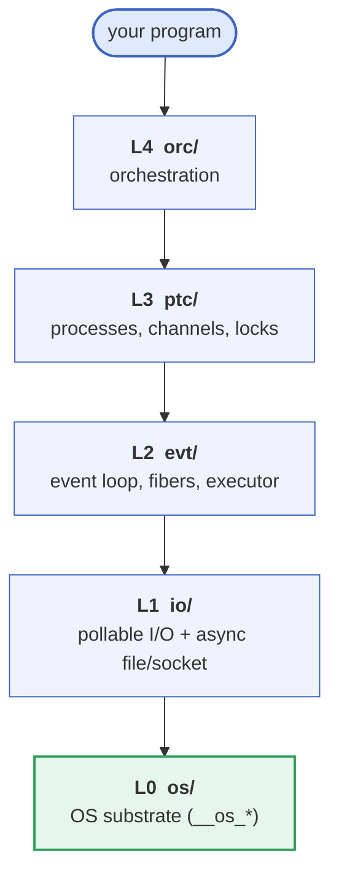

1. TOC
{:toc}

---

This is the short reference for the libxtc layering -- a five-minute
orientation. The per-layer man pages
([`xtc(7)`](https://codeberg.org/gregburd/libxtc/src/branch/main/man/man7/xtc.7)
and the [API reference]({{ '/reference/api/' | relative_url }})) are the
detail. libxtc is built in strict layers: each layer knows only the ones
below it, has its own internal header, its own subdirectory under
`src/`, and its own test binary under `test/`.

## The five layers

Lower layers know nothing of upper layers. A program links the whole
stack but writes to whichever layer it needs -- most use L3/L4 (processes
and supervisors); a few reach down to L2 (bare fibers and the loop).

## What each layer owns, in detail

```mermaid
flowchart TD
    subgraph L4["L4 &mdash; orc/ &mdash; orchestration"]
        direction LR
        A4["supervisors<br/>(4 strategies)"]
        B4["xtc_svr<br/>(gen_server)"]
        C4["xtc_app<br/>(lifecycle)"]
        D4["xtc_reg<br/>(registry)"]
        E4["tnt<br/>(Isolate layer)"]
    end
    subgraph L3["L3 &mdash; ptc/ &mdash; processes, threads, channels"]
        direction LR
        A3["PIDs, mailboxes,<br/>selective receive"]
        B3["links + monitors"]
        C3["channels,<br/>dispatch/reply"]
        D3["locks: RCU, lwlock,<br/>lrlock, lock mgr"]
        E3["log, cfg,<br/>observability,<br/>blocking contract"]
    end
    subgraph L2["L2 &mdash; evt/ &mdash; event runtime"]
        direction LR
        A2["per-thread reactor,<br/>run queue"]
        B2["work-stealing deque,<br/>executor"]
        C2["task lifecycle,<br/>wakers, timer wheel"]
        D2["coroutine substrate<br/>(fcontext + protothreads)"]
    end
    subgraph L1["L1 &mdash; io/ &mdash; pollable I/O"]
        direction LR
        A1["io_uring / epoll /<br/>kqueue / IOCP /<br/>event ports / poll"]
        B1["async file, socket,<br/>timer registration"]
    end
    subgraph L0["L0 &mdash; os/ &mdash; OS substrate (__os_*)"]
        direction LR
        A0["threads, mutex,<br/>atomics, TLS"]
        B0["time, files, shm,<br/>mmap, signals"]
        C0["allocator hook,<br/>CPU/NUMA topology"]
        D0["errno -> xtc_err,<br/>rng, env, dlopen"]
    end
    L4 --> L3 --> L2 --> L1 --> L0
    classDef grp fill:#eef4ff,stroke:#4066c0;
```

## Key design choices

- **Shared-nothing reactors by default.** Cross-loop communication is
  only ever explicit -- a channel, a mailbox, or a shared-buffer handle.
  There is no implicit shared mutable state between loops.
- **Configure-time backend selection, never runtime.** The I/O backend
  and coroutine substrate are chosen when you build, so there is no
  vtable dispatch on the hot path.
- **C11 dialect**, portable across Linux, the BSDs, macOS, illumos, and
  Windows.
- **Graceful degradation** to single-thread + `poll(2)` +
  Duff's-device protothreads when a platform is too constrained for
  fibers and async I/O.
- **[BDB](https://github.com/berkeleydb/libdb) conventions throughout**
  -- the `__os_*` OS-abstraction wrappers, the `__xtc_*` / `xtc_*` /
  `XTC_E_*` naming, `PUBLIC:` markers, the `dist/s_*` mechanical
  generators, and an enforced out-of-source build -- a discipline
  borrowed from Berkeley DB, where it kept a large C codebase portable
  and reviewable for decades.
- **Test-first, claim-driven.** Every claim in code or documentation has
  a test; see [Testing]({{ '/testing/' | relative_url }}).
- **Mechanical change as doctrine.** Structural edits (the public-symbol
  extern lists, the amalgamation) go through the `dist/s_*` generators
  rather than by hand.

## Module status

| Layer | Status |
|---|---|
| L0 `os/` | Complete: hookable allocator (BDB out-parameter convention), atomics, monotonic + wall clock, threads / TLS / mutex / rwlock / cond / sem, signals, files, shm, NUMA topology, and the rest of the OS substrate. |
| L1 `io/` | Complete: `xtc_io` over io_uring / epoll / poll / select (Linux), kqueue (BSD, macOS), event ports (illumos), IOCP (Windows); async file and socket registration; AIX `pollset` compiled, awaiting a host. |
| L2 `evt/` | Complete: `xtc_loop` (run queue, timer wheel, task / waker / park); stackful fibers (hand-written `fcontext` asm on the common arches, `ucontext` fallback, Win32 fibers on Windows) plus header-only protothreads; `async` / `await` / `xtc_yield`; `xtc_exec` multi-loop work-stealing executor. |
| L3 `ptc/` | Complete: channels (oneshot / mpsc / mpmc / watch / broadcast); processes, mailboxes with selective receive, links and monitors; sync primitives; `xtc_mctx`; RCU; left-right locks; and a full nine-mode lock manager with deadlock detection, victim policies, and per-locker timeouts. |
| L4 `orc/` | Complete: supervisor (4 strategies + restart intensity), process registry, `xtc_svr` gen_server, `xtc_app` lifecycle, and the optional [Isolate layer]({{ '/tnt/' | relative_url }}). |

## Reading order for a new contributor

1. This page, for the layer map.
2. The [Guide]({{ '/guide/' | relative_url }}), read in order.
3. [ABI stability]({{ '/reference/abi-stability/' | relative_url }}) --
   the longevity contract.
4. The [API reference]({{ '/reference/api/' | relative_url }}) for the
   layer you are working in.
