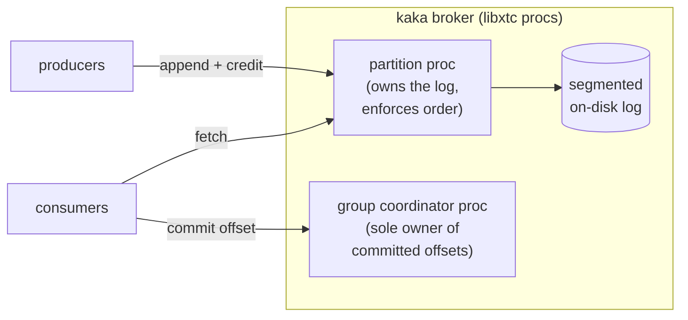

1. TOC
{:toc}

---

Source:
[`examples/07_kaka/`](https://codeberg.org/gregburd/libxtc/src/branch/main/examples/07_kaka)
(~2,800 lines of C, including tests).

## The software that inspired it

[Apache Kafka](https://kafka.apache.org/) is the canonical distributed
commit log: producers append records to **partitions** (ordered,
append-only logs), consumers read from an **offset** they track, and
**consumer groups** coordinate who reads what. Kafka is a JVM system
whose throughput comes from sequential disk I/O and the page cache;
[Redpanda](https://redpanda.com/) reimplemented the same protocol in C++
on [Seastar](https://seastar.io/) -- thread-per-core, shared-nothing,
no page cache -- to get lower and flatter latency. That Seastar lineage
is exactly the model libxtc brings to C.

`kaka` is a single-broker, partitioned log service modelled on Kafka's
data path. It is not a Kafka wire-protocol implementation; it is the
*shape* -- producers, partitions, segmented logs, consumer-group offsets
-- built to exercise the parts of libxtc the other examples do not:
sustained backpressure and per-partition ordering.

## Similar, and different



**Similar:** partitions are per-partition-ordered append-only logs;
records land in CRC-framed segment files that roll at a size threshold;
consumer groups commit offsets that survive a restart (replayed from the
durable log). This is Kafka's data model.

**Different:** each partition is a **libxtc process** that solely owns
its log, so per-partition ordering is guaranteed by single ownership
rather than by locks. The **group coordinator** is one process that owns
all committed offsets -- because it is the sole owner, offset commits
need **no lock at all**. This is the Seastar/Redpanda shared-nothing idea
expressed with lightweight processes instead of OS threads.

## How it works

- **`broker.c`** -- the broker: accepts producers/consumers, routes to
  partitions.
- **`partition.c`** -- one process per partition; appends records,
  enforces order, rolls segment files, serves fetches.
- **`group.c`** -- the consumer-group coordinator process; sole owner of
  committed offsets, durable via the segmented log with replay on
  restart.
- **`frame.c`** -- the record/segment frame codec (CRC-framed).
- **Backpressure** is **credit-based**: a producer gets a bounded credit
  window; the partition returns credit as it durably persists records,
  so a fast producer cannot outrun a slow disk and balloon memory. The
  in-process test drives budget 4 against 200 records and confirms peak
  in-flight stays at 4.

## How libxtc concepts are applied

- **Supervision.** The broker and its partition/coordinator procs run
  under a supervisor, so a partition proc that fails is restarted from
  its durable log rather than taking the broker down.
- **Data sharing.** There is almost none, by design: each partition proc
  *solely owns* its log, and the coordinator *solely owns* committed
  offsets. Single ownership is the pure-message-passing ideal --
  per-partition ordering and lock-free offset commit both fall out of it,
  no shared structure required.
- **Locking.** None on the hot paths. The coordinator being the sole
  writer of offsets means the busiest coordination point in a log broker
  has no lock at all.
- **Backpressure.** Credit accounting lives in each partition proc's
  private state; a producer fiber parks when out of credit and resumes
  when credit returns -- flow control with no condition variables.

## Advantages of building it on libxtc

- **Ordering for free.** Per-partition order is a consequence of a
  single owning process, not a lock discipline you have to prove correct.
- **Lock-free offsets.** The coordinator being the sole writer means the
  hottest coordination point in a log broker -- offset commit -- has no
  contention primitive at all.
- **Backpressure is natural.** Credit accounting lives in the partition
  process's private state; the producer fiber simply parks when it is out
  of credit and resumes when credit returns -- no condition-variable
  choreography.

## Challenges (warts and all)

- **Single broker only.** Real Kafka/Redpanda are distributed with
  replication and leader election; kaka is deliberately one broker. The
  cross-node story is the subject of libxtc's distributed-module design,
  not this example -- and the docs say so rather than implying kaka is a
  cluster.
- **Segment management is real work.** Rolling, scanning for recovery,
  and truncating on a torn tail are the fiddly parts; the example
  includes a restart test that appends thousands of records and replays
  them to prove the segment format survives a crash.

## Run it

```sh
cd examples/07_kaka && make XTC_BUILD=../../build
./test_partition && ./test_group && ./test_broker    # in-process tests
```

---

&larr; [sqlxtc (SQLite)]({{ '/examples/sqlxtc/' | relative_url }}) &middot;
Next: [tnt (Seastar / Tina)]({{ '/examples/tnt/' | relative_url }}) &rarr;
