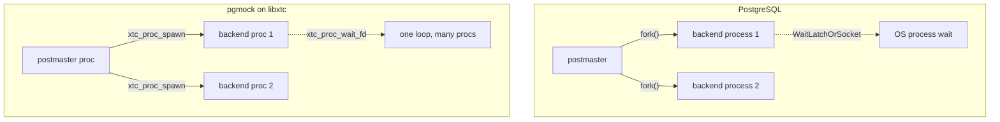

1. TOC
{:toc}

---

Source:
[`examples/09_pgmock/`](https://codeberg.org/gregburd/libxtc/src/branch/main/examples/09_pgmock)
(~680 lines of C).

## The software that inspired it

[PostgreSQL](https://www.postgresql.org/) is a **process-per-connection**
database: the postmaster `fork()`s a dedicated backend process for every
client. That design has given PostgreSQL decades of robustness --
isolation and crash-containment come free from OS processes -- but it is
also why threading PostgreSQL has been a multi-year community effort:
the code assumes a private address space per connection, waits on a
`Latch` or a socket via `WaitLatchOrSocket`, and takes process-directed
signals.

libxtc's long-term north star is to be the runtime that makes a
**threaded PostgreSQL** tractable. `pgmock` is the smallest honest step
toward that: it proves the *runtime seam* -- no-fork connection
multiplexing and latch/socket waiting -- without touching a line of
PostgreSQL source.

## Similar, and different



**Similar:** a postmaster that accepts connections and hands each to a
dedicated backend; each backend speaks the PostgreSQL v3 wire protocol
(a minimal handshake plus `SELECT 1`).

**Different:** where PostgreSQL `fork()`s an OS process per connection,
pgmock **`xtc_proc_spawn`s a lightweight process** on the shared loop --
no fork, no separate address space. PostgreSQL's `WaitLatchOrSocket`
becomes
[`xtc_proc_wait_fd`](https://codeberg.org/gregburd/libxtc/src/branch/main/man/man3/xtc_proc.3);
the postmaster's accept loop becomes a supervised process.

## How it works

- **`main.c` / `listener.c`** -- the postmaster process accepts TCP
  connections and spawns one backend process per client.
- **`backend.c`** -- a hand-rolled minimal PostgreSQL v3 wire handshake
  (startup message, authentication-OK, parameter status, ready-for-query)
  and a canned response to `SELECT 1`.
- **`pg_latch.c`** -- a shim mapping PostgreSQL's `Latch` /
  `WaitLatchOrSocket` semantics onto `xtc_proc_wait_fd`, which is the
  seam a real adapter would use.

There is **zero PostgreSQL code** here; pgmock only mimics the wire
protocol closely enough to prove the multiplexing and waiting model.

## Advantages of building it on libxtc

- **No fork, one address space.** Backends are lightweight processes on
  a shared loop, which is the whole point of threading PostgreSQL --
  shared buffers without IPC, far cheaper connection setup.
- **The wait primitive maps cleanly.** `WaitLatchOrSocket` is exactly
  what `xtc_proc_wait_fd` provides; the seam is a thin shim, not a
  rewrite.
- **Signal-mask correctness is already handled.** libxtc creates its
  runtime threads with signals blocked so a process-directed signal
  (PostgreSQL leans heavily on `SIGCHLD`, `SIGHUP`, etc.) lands only on
  a thread the embedder designates -- a real bug an earlier PG-on-libxtc
  experiment hit, now a property of the runtime.

## Challenges (warts and all)

- **This is a mock, and says so.** pgmock proves the runtime seam; it is
  *not* a threaded PostgreSQL. The real adapter has to bridge
  `MemoryContext`, GUC, the signal/CFI machinery, and
  `src/backend/storage/aio` -- a large effort tracked as design work, not
  claimed as done.
- **Process-per-connection assumptions run deep in PG.** The value of
  pgmock is precisely that it lets those assumptions be tested against
  the runtime one seam at a time, before any PostgreSQL source is
  touched.

## Run it

```sh
cd examples/09_pgmock && make XTC_BUILD=../../build
./pgmock &
psql -h 127.0.0.1 -p <port> -c 'SELECT 1'   # minimal handshake + SELECT 1
```

---

&larr; [tnt (Seastar / Tina)]({{ '/examples/tnt/' | relative_url }}) &middot;
Back to [Examples]({{ '/examples/' | relative_url }})
