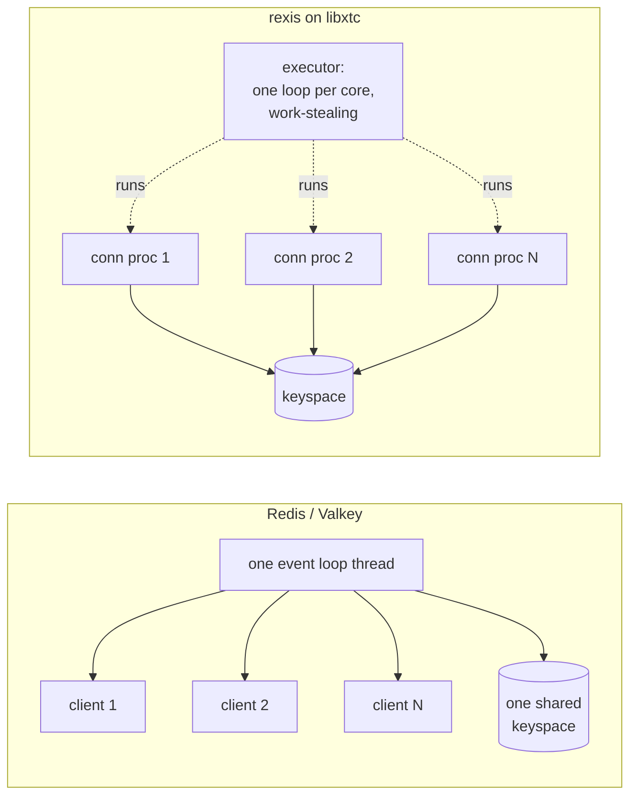

1. TOC
{:toc}

---

Source:
[`examples/05_rexis/`](https://codeberg.org/gregburd/libxtc/src/branch/main/examples/05_rexis)
(~4,500 lines of C, including tests).

## The software that inspired it

[Redis](https://redis.io/) (and its fork
[Valkey](https://valkey.io/)) is an in-memory data-structure server
spoken over the **RESP** wire protocol. Its defining architectural
choice is a **single-threaded event loop**: one thread runs an
`epoll`/`kqueue` reactor, and every command executes to completion on
that thread. That is why Redis commands are atomic without locks -- there
is only one thread. The cost is that one CPU serves all clients, and a
slow command (a big `KEYS`, a large sorted-set operation) stalls
everyone.

`rexis` is a drop-in server for a meaningful subset of Redis: you can
point `redis-cli` at it and run `SET`/`GET`/`DEL`/`EXPIRE` and friends.
It exists to answer a question: *what does Redis's model look like if
the runtime gives you cheap concurrency instead of forcing
single-threadedness?*

## Similar, and different



**Similar:** the RESP protocol, the command semantics, the in-memory
keyspace, and an optional persistent log (rexis uses a
[bitcask](https://riak.com/assets/bitcask-intro.pdf)-style append store,
Redis uses RDB/AOF).

**Different:** where Redis pins everything to one thread, rexis runs
**one lightweight process per connection** across an executor of one
loop per core. Each connection process parses its own commands and owns
its own protocol state -- there is no shared connection table to lock. A
slow command occupies its own process and can be preempted or parked
without stalling other clients.

## How it works

- **`main.c`** stands up an `xtc_app` with a supervised TCP listener.
- **`conn.c`** -- the listener accepts a socket and spawns one
  connection process per client (`xtc_proc_spawn`). The process loops:
  read from the socket (parking the fiber via the reactor when the
  socket is not ready), parse a RESP command, apply it, write the reply.
- **`db.c`** holds the keyspace; **`expire.c`** handles TTLs;
  **`bitcask.c`** is the append-only persistence layer.
- **`metrics.c`** exposes counters via
  [`xtc_stats(3)`](https://codeberg.org/gregburd/libxtc/src/branch/main/man/man3/xtc_stats.3).
- Memory is bounded by
  [`xtc_res(3)`](https://codeberg.org/gregburd/libxtc/src/branch/main/man/man3/xtc_res.3)
  budgets, so a client flood is *rejected* at a cap rather than driving
  the server to OOM -- something Redis controls with `maxmemory` and an
  eviction policy.

## Advantages of building it on libxtc

- **Concurrency without a lock graph.** Each connection's state is
  private to its process, so the parser, the buffers, and the in-flight
  command have exactly one owner. There is no shared connection registry
  to protect.
- **Uses every core** without turning atomic-by-single-thread into a
  lock nightmare: the keyspace is the one shared structure, and it can
  be guarded by a single primitive (or sharded) rather than by ad-hoc
  locking spread across the codebase.
- **Backpressure and budgets are first-class** (`xtc_res`), not bolted
  on.

## Challenges (warts and all)

- **The shared keyspace is the real concurrency question.** Redis dodges
  it by being single-threaded; rexis has to decide how concurrent
  connection processes see the keyspace. The example keeps this simple
  (a single owning structure) rather than pretending it solved
  distributed sharding -- see the code for exactly where the line is
  drawn.
- **RESP is deceptively fiddly** (inline vs. multibulk, partial reads
  across socket boundaries); the parser has to resume cleanly when a
  command spans two `read`s, which is exactly the kind of state that
  fibers keep on the stack instead of in a hand-rolled parser context.

## Run it

```sh
cd examples/05_rexis && make XTC_BUILD=../../build
./rexis &                       # listens on the RESP port
redis-cli set hello world
redis-cli get hello             # -> "world"
```

---

Next: [sqlxtc (SQLite)]({{ '/examples/sqlxtc/' | relative_url }}) &rarr;
