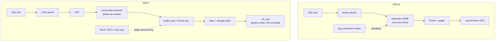
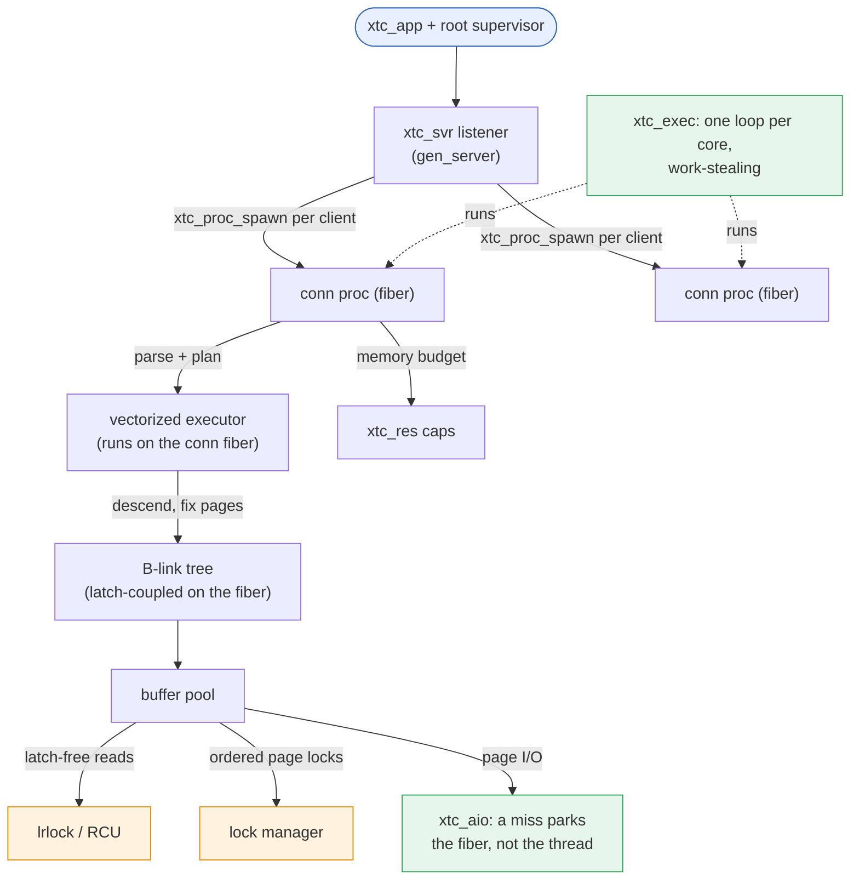

1. TOC
{:toc}

---

Source:
[`examples/06_sqlxtc/`](https://codeberg.org/gregburd/libxtc/src/branch/main/examples/06_sqlxtc)
(~45,000 lines of C, including a large test suite). This is the most
demanding use of the library and the one that drove much of its
hardening.

## The software that inspired it

[SQLite](https://www.sqlite.org/) is the most-deployed database engine
in the world: a compact, embeddable, single-file SQL engine. Its
concurrency model is deliberately conservative -- by default a database
connection serializes through a single big mutex
(`SQLITE_CONFIG_SERIALIZED`), and even in WAL mode writers are
serialized. SQLite's own I/O is synchronous through a VFS shim. This is
exactly right for an embedded engine on one device; it is a poor fit for
a server that wants to use many cores and keep latency flat under
concurrency.

`sqlxtc` asks: *if you started a server-class SQL engine today, with a
fiber runtime in hand, what would each layer look like?* Rather than
embed SQLite and fight its threading model, sqlxtc builds the whole
stack fresh so every layer is fiber-aware and deterministically
testable.

## Similar, and different



**Similar:** it is a SQL engine -- parse, plan, execute against a
transactional, crash-safe, page-based store with a write-ahead log. The
storage concepts (B-tree pages, a buffer pool, WAL, recovery) are the
textbook ones SQLite also uses.

**Different in three big ways:**

1. **Parser.** SQLite uses the lemon parser generator; sqlxtc uses
   [**Lime**](https://codeberg.org/gregburd/lime), a parser generator,
   to produce its grammar-driven parser (`sql_parse.c` from
   `sql_grammar` via Lime).
2. **Executor.** SQLite's VDBE interprets bytecode one row at a time;
   sqlxtc's `vexec.c` is **vectorized** -- it processes batches of rows,
   which is the modern analytic-engine shape and far friendlier to the
   CPU.
3. **Concurrency and I/O.** SQLite serializes on a mutex and does
   synchronous I/O; sqlxtc uses libxtc's
   [left-right locks]({{ '/reference/locks/' | relative_url }}), RCU, and
   the lock manager for page concurrency, and routes every disk
   operation through
   [`xtc_aio(3)`](https://codeberg.org/gregburd/libxtc/src/branch/main/man/man3/xtc_aio.3)
   so a slow read **parks a fiber, not a thread**.

## How it works

- **`conn.c` / `main.c`** -- a connection process per client, speaking a
  small JSON protocol ("Quack") over TCP; many concurrent clients.
- **`sql_parse.c`** -- the
  [Lime](https://codeberg.org/gregburd/lime)-generated parser, driven by
  `sql_parse_drv.c`, producing an AST (`sql_ast.c`).
- **`vexec.c`** -- the vectorized executor.
- **`bufmgr.c`** -- the buffer pool: pinning, eviction (CLOCK with a
  double-write buffer), and the pin-accounting that DST and ASan hardened
  (see [Known issues]({{ '/reference/known-issues/' | relative_url }}) for
  the pin-race history).
- **`btree.c` / `btnode.c`** -- a B-link tree with concurrent,
  latch-coupled descents and latch-free reads.
- **`wal.c` / `xlog.c`** -- write-ahead logging, group commit, and
  crash recovery (redo/undo), all validated under the deterministic
  simulator.

## How libxtc concepts are applied

The SQLite-vs-sqlxtc diagram above is drawn as boxes, but every box is
really libxtc machinery. Here is the runtime shape:



- **Supervision.** The server is an `xtc_app` with a root supervisor; the
  connection front door is an `xtc_svr` gen_server. A connection proc
  that crashes is contained and does not take the server down --
  [let it crash]({{ '/philosophy/let-it-crash/' | relative_url }}) at the
  connection granularity.
- **The executor and the B-tree run on fibers, not threads.** Each
  connection is a fiber (`xtc_proc_spawn`) on the multi-loop `xtc_exec`
  executor; the vectorized executor and the B-link-tree descent run
  *on that fiber*. A page fix that misses does not block a thread -- it
  parks the fiber via `xtc_aio` and the loop serves other connections
  until the read completes. This is the whole reason to build on libxtc:
  storage-engine code reads like straight-line synchronous C yet never
  stalls a core.
- **Data sharing.** The buffer pool and B-link tree are the *shared*
  structures (the deliberate
  [compromise]({{ '/philosophy/message-passing/' | relative_url }}) away
  from pure message passing, because copying pages through mailboxes
  would be absurd). Reads go latch-free through `lrlock` / RCU; ordered
  multi-page access uses the deadlock-detecting lock manager. Connection
  *state*, by contrast, is private to each conn fiber -- shared-nothing
  where it can be, shared-with-discipline where it must be.
- **Locking.** Latch-coupling on the B-link tree uses short page latches;
  the lock manager handles the cases that need ordered locks with
  deadlock detection -- the thing hand-rolled `pthread_mutex` ordering
  cannot give you.
- **Resource limits.** `xtc_res` caps bound memory and in-flight work so
  a query storm degrades instead of OOMing.

## Advantages of building it on libxtc

- **Every layer is fiber-aware.** A page miss parks the requesting fiber
  and the loop keeps serving others; there is no thread blocked on a
  read, and no callback soup.
- **Deterministic testing of the whole engine.** Because all I/O and
  scheduling flow through libxtc, the simulator can replay a full
  transaction workload -- with injected torn writes, crashes, and
  fsync-loss -- from a seed. The storage engine's crash-safety is a
  *tested* property, not a hope. See [Testing]({{ '/testing/' | relative_url }}).
- **Real concurrency primitives.** lrlock and RCU give latch-free reads
  on hot structures; the lock manager gives deadlock detection where the
  B-tree needs ordered locks.

## Challenges (warts and all)

- **It is a lot of code.** Rebuilding a storage engine is ~45k lines;
  embedding SQLite would have been a fraction of that. The payoff is
  fiber-awareness and testability an off-the-shelf engine with its own
  threading cannot give -- but the cost is real and worth stating
  plainly.
- **Buffer-manager pin accounting is genuinely hard.** The concurrent
  demand-load / eviction path had real races (a stale swip clobbering a
  fresh pin, a load publishing a frame before pinning it) that only the
  deterministic simulator plus ASan pinned down. Those fixes -- and the
  one residual epoll lost-wakeup shape -- are documented honestly in
  [Known issues]({{ '/reference/known-issues/' | relative_url }}).
- **Cross-thread wakeups under a multi-loop executor** were where sqlxtc
  found real library bugs (a proc parking its wait fd on the wrong
  loop's ring). The engine's pressure is precisely what made those
  bugs reproducible -- an argument for building the hard example.

## Run it

```sh
cd examples/06_sqlxtc && make XTC_BUILD=../../build sqlxtc-server
./sqlxtc-server &
# then talk the Quack JSON protocol, or run the in-process test suite:
make XTC_BUILD=../../build test-mvcc test-wal-recover test-btree
```

---

&larr; [rexis (Redis)]({{ '/examples/rexis/' | relative_url }}) &middot;
Next: [kaka (Kafka)]({{ '/examples/kaka/' | relative_url }}) &rarr;
