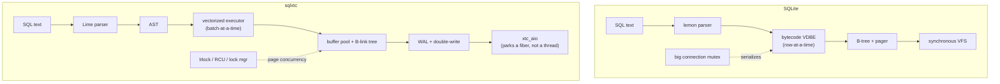
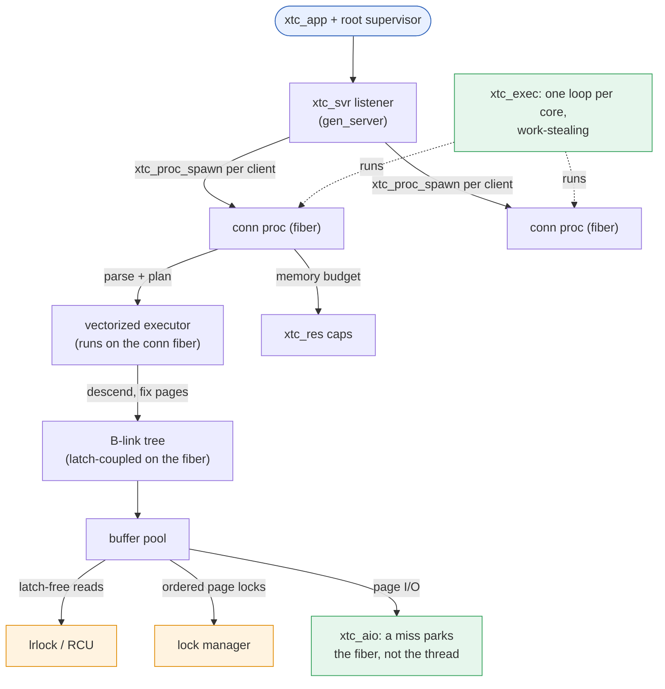

1. TOC
{:toc}

---

Source:
[`examples/06_sqlxtc/`](https://codeberg.org/gregburd/libxtc/src/branch/main/examples/06_sqlxtc)
(~45,000 lines of C, including a large test suite). This is the most
demanding use of the library and the one that drove much of its
hardening.

## The software that inspired it

[SQLite](https://www.sqlite.org/) is the most-deployed database engine
in the world: a compact, embeddable, single-file SQL engine. Its
concurrency model is deliberately conservative -- by default a database
connection serializes through a single big mutex
(`SQLITE_CONFIG_SERIALIZED`), and even in WAL mode writers are
serialized. SQLite's own I/O is synchronous through a VFS shim. This is
exactly right for an embedded engine on one device; it is a poor fit for
a server that wants to use many cores and keep latency flat under
concurrency.

`sqlxtc` asks: *if you started a server-class SQL engine today, with a
fiber runtime in hand, what would each layer look like?* Rather than
embed SQLite and fight its threading model, sqlxtc builds the whole
stack fresh so every layer is fiber-aware and deterministically
testable.

## Similar, and different


```mermaid
flowchart TD
    subgraph SQLite
        Q1["SQL text"] --> P1["lemon parser"]
        P1 --> V1["bytecode VDBE<br/>(row-at-a-time)"]
        V1 --> B1["B-tree + pager"]
        B1 --> VFS["synchronous VFS"]
        L1["big connection mutex"] -.->|serializes| V1
    end
    subgraph sqlxtc
        Q2["SQL text"] --> P2["Lime parser"]
        P2 --> AST["AST"]
        AST --> VX["vectorized executor<br/>(batch-at-a-time)"]
        VX --> BM["buffer pool + B-link tree"]
        BM --> WAL["WAL + double-write"]
        WAL --> AIO["xtc_aio<br/>(parks a fiber, not a thread)"]
        LR["lrlock / RCU / lock mgr"] -.->|page concurrency| BM
    end
```

**Similar:** it is a SQL engine -- parse, plan, execute against a
transactional, crash-safe, page-based store with a write-ahead log. The
storage concepts (B-tree pages, a buffer pool, WAL, recovery) are the
textbook ones SQLite also uses.

**Different in three big ways:**

1. **Parser.** SQLite uses the lemon parser generator; sqlxtc uses
   [**Lime**](https://codeberg.org/gregburd/lime), a parser generator,
   to produce its grammar-driven parser (`sql_parse.c` from
   `sql_grammar` via Lime).
2. **Executor.** SQLite's VDBE interprets bytecode one row at a time;
   sqlxtc's `vexec.c` is **vectorized** -- it processes batches of rows,
   which is the modern analytic-engine shape and far friendlier to the
   CPU.
3. **Concurrency and I/O.** SQLite serializes on a mutex and does
   synchronous I/O; sqlxtc uses libxtc's
   [left-right locks]({{ '/reference/locks/' | relative_url }}), RCU, and
   the lock manager for page concurrency, and routes every disk
   operation through
   [`xtc_aio(3)`](https://codeberg.org/gregburd/libxtc/src/branch/main/man/man3/xtc_aio.3)
   so a slow read **parks a fiber, not a thread**.

## How it works

- **`conn.c` / `main.c`** -- a connection process per client, speaking a
  small JSON protocol ("Quack") over TCP; many concurrent clients.
- **`sql_parse.c`** -- the
  [Lime](https://codeberg.org/gregburd/lime)-generated parser, driven by
  `sql_parse_drv.c`, producing an AST (`sql_ast.c`).
- **`vexec.c`** -- the vectorized executor.
- **`bufmgr.c`** -- the buffer pool: pinning, eviction (CLOCK with a
  double-write buffer), and the pin-accounting that DST and ASan hardened
  (see [Known issues]({{ '/reference/known-issues/' | relative_url }}) for
  the pin-race history).
- **`btree.c` / `btnode.c`** -- a B-link tree with concurrent,
  latch-coupled descents and latch-free reads.
- **`wal.c` / `xlog.c`** -- write-ahead logging, group commit, and
  crash recovery (redo/undo), all validated under the deterministic
  simulator.

## Buffer replacement: HOT/COOL and CLOCK

The default replacement policy combines a CLOCK hand, HOT/COOL retention
states, and a separate one-bit reference flag. These are complementary:
CLOCK determines which frame to inspect; HOT/COOL expresses retention
preference; the reference flag grants another chance to a recently used
page. With scan resistance enabled, a demand-loaded page enters COOL and
a second resident access promotes it to HOT. A scan need not promote
every page it reads into the hot working set.

`bm_opts_t.claim_threshold` controls an optional protection-work governor.
After that many HOT passes/demotions or reference-bit second chances in
one eviction call, the sweep stops honoring those preferences for its
next eligible victim. Pins, in-flight I/O, and reservation checks still
apply; dirty candidates require writeback. Zero preserves legacy
selection. The default is zero; 128 is a measured opt-in value, not a
universal recommendation. This option applies to CLOCK, not the optional
sampled-eviction implementation.

The governor limits time spent protecting candidates, **not total
allocation latency**. Pinned pages, writeback, competing allocators, and
retries can exceed the nominal budget. The cost is evicting useful pages
sooner. A near-full sequential hot-set fixture demonstrates sustained
churn with a small budget; a shorter individual sweep does not imply
less total work.

### Measuring the trade-off

The standalone `bm_sweep_bench` Makefile target compares thresholds in
one binary. Its positional arguments are threshold, duration in seconds,
disposable store path, frame count, page count, loop count, fiber count,
Zipf exponent multiplied by 100, direct-I/O flag, and seed. It validates
read-back page ids, requires sustained eviction during warm-up, and
reports one CSV row. It does not start the provider or trickler.

A FreeBSD 15.1 m6id.8xlarge run on local NVMe used 4 KiB pages, 16 loops,
128 fibers, Zipf exponent 1.10, and a dataset 1.125 times the pool.
Thresholds 0 and 128 alternated over three repetitions each; measured
windows lasted 20 seconds after eviction warm-up. These measurements
precede the subsequent writeback-pinning and stale-load publication fixes;
they motivate the governor but are not qualification numbers for the
final release tree. Medians:

| Pool frames | Ops/s, 0 | Ops/s, 128 | Hit %, 0 | Hit %, 128 | p99.9 ms, 0 | p99.9 ms, 128 |
| ---: | ---: | ---: | ---: | ---: | ---: | ---: |
| 16,384 | 2,954,644 | 3,869,069 | 99.0534 | 98.9779 | 5.888 | 4.864 |
| 65,536 | 2,268,189 | 5,103,385 | 99.2586 | 99.1795 | 8.704 | 4.096 |
| 262,144 | 1,669,002 | 6,330,307 | 99.4441 | 99.3374 | 11.776 | 3.584 |

At 16K frames, p99 **worsened from 2 us to 608 us** as misses crossed
one percent, despite higher throughput and lower p99.9. These are
read-only buffer-manager measurements, not SQL transaction results.
They do not establish write-heavy performance or device-level read
amplification. Quantiles are histogram bucket lower bounds, sampled in
microseconds. Independent fixed-duration arms execute different request
counts, not a lockstep request trace.

The added `bm_stats_t` counters describe successful CLOCK reclamations:
`allocs` counts successful eviction calls, `advances` their frame visits,
`adv_max` the largest such visit count, and `forced_claims` reclaims after
the budget expired. Failed calls and allocation retries are excluded;
`advances / allocs` is scan work per successful reclaim, not total I/O
amplification. The benchmark's sweep maximum includes warm-up.

### Checkpoint LSN continuity

Compacting the WAL must not restart its log sequence numbers. Data-page
LSNs survive compaction, and in-place recovery compares each image's
record LSN against the page LSN before applying it. Restarting at one
can incorrectly suppress newer images. The compaction emitter continues
above the old log's highest issued LSN; rebinding resumes from the
compacted file's maximum. The LSN monotonicity regression and the fuzzy
checkpoint test exercise this rule, including forced eviction.

## Concurrent page publication and writeback

A miss loads a page into a private frame before publishing it in the
page table. Checking only whether that pid is resident at publication
is insufficient: another loader can publish it, a writer can change it,
and eviction can flush and remove it before the first read completes.
Publishing that delayed read would restore an obsolete image, including
keys that a successful B-tree delete removed.

The buffer manager validates page-table generation across the read. A
mapping change invalidates a private image when no resident winner is
available; the reader releases its frame and retries. No page-table
mutex spans the I/O. A regression pauses the original loader while a
second loader completes a delete, checkpoint, and eviction, then verifies
that resuming the delayed read cannot resurrect the key.

Eviction also rechecks dirty and I/O state after reserving an unpinned
frame: a writer can dirty and unpin between the initial checks and the
reservation. Writeback itself holds a pin through completion so that
snapshotting and disk I/O cannot race frame recycling. Releasing that
internal pin does not mark the page recently accessed. Page-ID quarantine
also waits for old frame owners, including writeback: a live old snapshot
must not overwrite a newly allocated page using the same id. Draining
quarantine makes an id reusable, not readable: retired-id membership
continues to reject disk loads until allocation publishes an initialized
replacement. Otherwise a delayed descent can delete from an obsolete
pre-merge image while the live key remains in the merged sibling.
Publication establishes the loader's pin before exposing the frame and never resets
the count after readers can increment it. Private page-in frames stay
unpinnable until their data is ready. These are storage correctness
requirements independent of the optional sweep governor.

The server sets the runtime fiber stack size to 512 KiB before creating
fibers. SQL parsing and execution, especially with sanitizer instrumentation,
need more headroom than the runtime's 64 KiB default. Budget this larger
per-fiber virtual reservation when choosing the connection limit; it is
not a claim that each connection immediately consumes 512 KiB of RSS.

## How libxtc concepts are applied

The SQLite-vs-sqlxtc diagram above is drawn as boxes, but every box is
really libxtc machinery. Here is the runtime shape:


```mermaid
flowchart TD
    APP(["xtc_app + root supervisor"]):::sup --> SVR["xtc_svr listener<br/>(gen_server)"]
    SVR -->|xtc_proc_spawn per client| C1["conn proc (fiber)"]
    SVR -->|xtc_proc_spawn per client| C2["conn proc (fiber)"]
    EX["xtc_exec: one loop per core,<br/>work-stealing"]:::run -.->|runs| C1 & C2
    C1 -->|parse + plan| VX["vectorized executor<br/>(runs on the conn fiber)"]
    VX -->|descend, fix pages| BT["B-link tree<br/>(latch-coupled on the fiber)"]
    BT --> BM["buffer pool"]
    BM -->|latch-free reads| LR["lrlock / RCU"]:::lock
    BM -->|ordered page locks| LM["lock manager"]:::lock
    BM -->|page I/O| AIO["xtc_aio: a miss parks<br/>the fiber, not the thread"]:::run
    C1 -->|memory budget| RES["xtc_res caps"]
    classDef sup fill:#e8f0ff,stroke:#36b;
    classDef run fill:#e6f6ec,stroke:#2e9e57;
    classDef lock fill:#fff3e0,stroke:#e08a00;
```

- **Supervision.** The server is an `xtc_app` with a root supervisor; the
  connection front door is an `xtc_svr` gen_server. A connection proc
  that crashes is contained and does not take the server down --
  [let it crash]({{ '/philosophy/let-it-crash/' | relative_url }}) at the
  connection granularity.
- **The executor and the B-tree run on fibers, not threads.** Each
  connection is a fiber (`xtc_proc_spawn`) on the multi-loop `xtc_exec`
  executor; the vectorized executor and the B-link-tree descent run
  *on that fiber*. A page fix that misses does not block a thread -- it
  parks the fiber via `xtc_aio` and the loop serves other connections
  until the read completes. This is the whole reason to build on libxtc:
  storage-engine code reads like straight-line synchronous C yet never
  stalls a core.
- **Data sharing.** The buffer pool and B-link tree are the *shared*
  structures (the deliberate
  [compromise]({{ '/philosophy/message-passing/' | relative_url }}) away
  from pure message passing, because copying pages through mailboxes
  would be absurd). Reads go latch-free through `lrlock` / RCU; ordered
  multi-page access uses the deadlock-detecting lock manager. Connection
  *state*, by contrast, is private to each conn fiber -- shared-nothing
  where it can be, shared-with-discipline where it must be.
- **Locking.** Latch-coupling on the B-link tree uses short page latches;
  the lock manager handles the cases that need ordered locks with
  deadlock detection -- the thing hand-rolled `pthread_mutex` ordering
  cannot give you.
- **Resource limits.** `xtc_res` caps bound memory and in-flight work so
  a query storm degrades instead of OOMing.

## Advantages of building it on libxtc

- **Every layer is fiber-aware.** A page miss parks the requesting fiber
  and the loop keeps serving others; there is no thread blocked on a
  read, and no callback soup.
- **Deterministic testing of the whole engine.** Because all I/O and
  scheduling flow through libxtc, the simulator can replay a full
  transaction workload -- with injected torn writes, crashes, and
  fsync-loss -- from a seed. The storage engine's crash-safety is a
  *tested* property, not a hope. See [Testing]({{ '/testing/' | relative_url }}).
- **Real concurrency primitives.** lrlock and RCU give latch-free reads
  on hot structures; the lock manager gives deadlock detection where the
  B-tree needs ordered locks.

## Challenges (warts and all)

- **It is a lot of code.** Rebuilding a storage engine is ~45k lines;
  embedding SQLite would have been a fraction of that. The payoff is
  fiber-awareness and testability an off-the-shelf engine with its own
  threading cannot give -- but the cost is real and worth stating
  plainly.
- **Buffer-manager pin accounting is genuinely hard.** The concurrent
  demand-load / eviction path had real races (a stale swip clobbering a
  fresh pin, a load publishing a frame before pinning it) that only the
  deterministic simulator plus ASan pinned down. Those fixes -- and the
  one residual epoll lost-wakeup shape -- are documented honestly in
  [Known issues]({{ '/reference/known-issues/' | relative_url }}).
- **Cross-thread wakeups under a multi-loop executor** were where sqlxtc
  found real library bugs (a proc parking its wait fd on the wrong
  loop's ring). The engine's pressure is precisely what made those
  bugs reproducible -- an argument for building the hard example.

## Run it

```sh
cd examples/06_sqlxtc && make XTC_BUILD=../../build sqlxtc-server
./sqlxtc-server &
# then talk the Quack JSON protocol, or run the in-process test suite:
make XTC_BUILD=../../build test-mvcc test-wal-recover test-btree
```

---

&larr; [rexis (Redis)]({{ '/examples/rexis/' | relative_url }}) &middot;
Next: [kaka (Kafka)]({{ '/examples/kaka/' | relative_url }}) &rarr;
