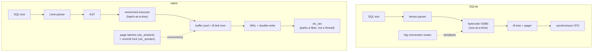

1. TOC
{:toc}

---

Source:
[`examples/06_sqlxtc/`](https://codeberg.org/gregburd/libxtc/src/branch/main/examples/06_sqlxtc)
(~45,000 lines of C, including a large test suite). This is the most
demanding use of the library and the one that drove much of its
hardening.

## The software that inspired it

[SQLite](https://www.sqlite.org/) is the most-deployed database engine
in the world: a compact, embeddable, single-file SQL engine. Its
concurrency model is deliberately conservative -- by default a database
connection serializes through a single big mutex
(`SQLITE_CONFIG_SERIALIZED`), and even in WAL mode writers are
serialized. SQLite's own I/O is synchronous through a VFS shim. This is
exactly right for an embedded engine on one device; it is a poor fit for
a server that wants to use many cores and keep latency flat under
concurrency.

`sqlxtc` asks: *if you started a server-class SQL engine today, with a
fiber runtime in hand, what would each layer look like?* Rather than
embed SQLite and fight its threading model, sqlxtc builds the whole
stack fresh so every layer is fiber-aware and deterministically
testable.

## Similar, and different


```mermaid
flowchart TD
    subgraph SQLite
        Q1["SQL text"] --> P1["lemon parser"]
        P1 --> V1["bytecode VDBE<br/>(row-at-a-time)"]
        V1 --> B1["B-tree + pager"]
        B1 --> VFS["synchronous VFS"]
        L1["big connection mutex"] -.->|serializes| V1
    end
    subgraph sqlxtc
        Q2["SQL text"] --> P2["Lime parser"]
        P2 --> AST["AST"]
        AST --> VX["vectorized executor<br/>(batch-at-a-time)"]
        VX --> BM["buffer pool + B-link tree"]
        BM --> WAL["WAL + double-write"]
        WAL --> AIO["xtc_aio<br/>(parks a fiber, not a thread)"]
        LT["page latches (xtc_arwlock)<br/>+ commit lock (xtc_amutex)"] -.->|concurrency| BM
    end
```

**Similar:** it is a SQL engine -- parse, plan, execute against a
transactional, crash-safe, page-based store with a write-ahead log. The
storage concepts (B-tree pages, a buffer pool, WAL, recovery) are the
textbook ones SQLite also uses.

**Different in three big ways:**

1. **Parser.** SQLite uses the lemon parser generator; sqlxtc uses
   [**Lime**](https://codeberg.org/gregburd/lime), a parser generator,
   to produce its grammar-driven parser (`sql_parse.c` from
   `sql_grammar` via Lime).
2. **Executor.** SQLite's VDBE interprets bytecode one row at a time;
   sqlxtc's `vexec.c` is **vectorized** -- it processes batches of rows,
   which is the modern analytic-engine shape and far friendlier to the
   CPU.
3. **Concurrency and I/O.** SQLite serializes on a mutex and does
   synchronous I/O; sqlxtc uses libxtc's parking latches
   (`xtc_arwlock` per buffer-pool frame, `xtc_amutex` for the catalog
   and the commit critical section) and MVCC versions, so readers never
   block writers, and routes every disk operation through
   [`xtc_aio(3)`](https://codeberg.org/gregburd/libxtc/src/branch/main/man/man3/xtc_aio.3)
   so a slow read **parks a fiber, not a thread**.

## How it works

- **`conn.c` / `main.c`** -- a connection process per client, speaking a
  small JSON protocol ("Quack") over TCP; many concurrent clients.
- **`sql_parse.c`** -- the
  [Lime](https://codeberg.org/gregburd/lime)-generated parser, driven by
  `sql_parse_drv.c`, producing an AST (`sql_ast.c`).
- **`vexec.c`** -- the vectorized executor and its planner: one
  access-path chooser (rowid range, longest-equality-prefix index seek,
  index order instead of a sort, MIN/MAX from the first or last key,
  index nested-loop joins) shared by SELECT, aggregates, ORDER BY,
  UPDATE and DELETE, and a per-statement plan cache. `vxfunc.c` holds
  the date/time, printf and math functions.
- **`bufmgr.c`** -- the buffer pool: pinning, eviction (CLOCK with a
  double-write buffer), and the pin-accounting that DST and ASan hardened
  (see [Known issues]({{ '/reference/known-issues/' | relative_url }}) for
  the pin-race history).
- **`btree.c` / `btnode.c` / `btovf.h`** -- a B-link tree with
  latch-free optimistic reads, leaf-only write latching, page-bounded
  entries and out-of-line large values (see below).
- **`wal.c` / `xlog.c`** -- write-ahead logging, group commit, and
  crash recovery (redo/undo), validated under the deterministic
  simulator and by kill -9 torture of the server.
- **`xstore.c`** -- the catalog and MVCC record store: per-connection
  transactions, snapshot reads, row write intents with deadlock
  detection, composite primary keys and UNIQUE constraints as
  order-preserving tuple indexes, and SSI for SERIALIZABLE.

## The B-tree, and what it borrows from RethinkDB

`btree.c` is a B-link tree (Lehman-Yao): every node carries fence keys
and a right-sibling link, so a descent that loses a race with a split
walks right instead of restarting. Readers take no latch at all on the
common path -- an optimistic descent validated by each frame's version
seqlock (OLC) -- and inserts latch only the leaf; splits and merges
serialize on a per-tree structure-modification lock and post separators
bottom-up. Nodes are slotted pages with prefix compression derived from
the fences and a 4-byte cached key head per slot.

1.57 compared this design against RethinkDB's B-tree
(`src/btree/`, `src/buffer_cache/`) and borrowed six things.

**Every entry is bounded by the page.** RethinkDB caps a leaf entry at
1/8 of a page (`leaf_epsilon`), and every split and merge guarantee
follows from that bound. sqlxtc had no bound: a 2 KB row could make a
4 KiB leaf unsplittable, and an indexed TEXT value over 1 KB overflowed
the split's separator buffer. Now `bt_max_key()` and `bt_max_inline()`
derive the limits from the page size (4 KiB pages: 498-byte keys, 506
bytes of key plus value inline), every call checks them before touching
anything, and leaves split **by bytes**, choosing the cut nearest half
that leaves room for the row being inserted (`btnode_split_ex`).

**Large values live out of line.** RethinkDB's blob stores a small
value inline and a large one in dedicated blocks referenced from the
leaf. sqlxtc does the same in one level: a value above the inline bound
is written to data pages first, and the leaf keeps a bounded reference
(flagged by the high bit of the slot's length field, so inline pages are
unchanged). Lookups and cursors reassemble it, checksum-verified; a
replace or delete frees the old pages only after the reference is gone,
while splits and merges only move the reference. B-tree values go up to
65535 bytes (the API's 16-bit length); the SQL engine above it stores at
most 4096 bytes per row and refuses a longer one with "row too large"
(see KNOWN_ISSUES).

**Writers do not hold the root.** RethinkDB's write descent keeps the
root write-locked across a child read, which serializes every later
operation (it compensates with page snapshots and eight shards per
table). sqlxtc's delete did the same; it now descends with shared
latches and takes only the leaf exclusive, which multiplied concurrent
delete throughput across four loops by eight.

**Questions about the whole tree are answered from the tree.**
RethinkDB keeps a population block and samples separator keys for
split points. sqlxtc's INSERT used to scan the whole table for the
largest rowid; `bt_seek_lt` answers it in one descent, so a single
INSERT takes the same 0.2 ms at 100k rows as at 1k (it was 9.6 ms).

**Split points come from the tree's own separators.** RethinkDB's
`get_distribution` samples the separator keys of the top levels to
estimate a key distribution in a handful of page reads. sqlxtc's
`bt_sample_keys` does the same, and the morsel-parallel scan cuts its
rowid range at those points instead of uniformly, so a table with
skewed rowids still splits into even morsels (1M rows, 90% of them in
the top 1% of the rowid space: the largest morsel went from 14.5x the
mean to 1.09x, and the 8-worker scan from 197 ms to 59 ms).

**Every node is checked after every change, in test builds.** RethinkDB
validates nodes after each mutation in debug builds. `btnode_check`
verifies a node's layout, space accounting, key order, fence
containment and out-of-line references; `-DBT_CHECK`, which is on
automatically under the deterministic simulator, runs it at every
mutation point, so a structural bug is reported at the operation that
caused it and pinned by a replayable seed.

What was deliberately *not* borrowed: per-entry replication timestamps
and in-page tombstones (backfill for replicas; the WAL is sqlxtc's
change stream), top-down proactive split/merge with root write locks
(strictly less concurrent than B-link), page-level copy-on-write
snapshots (sqlxtc has row-level MVCC), the log-structured serializer
(sqlxtc has a WAL with page LSNs), and the 250-byte key cap (sqlxtc's
16-bit keys with prefix compression are better; the page-derived bound
replaces it).

## Transactions and isolation

Every client connection has its own transaction (whatever `--threads`
is): its uncommitted writes are buffered privately and are invisible to
other connections until COMMIT, and ROLLBACK discards only its own
writes.

| Level | Reads | Write-write conflicts | Selected by |
| --- | --- | --- | --- |
| SNAPSHOT (default), REPEATABLE READ | one snapshot per transaction | the second writer of a row waits for the first; if the first commits, the second's statement fails | default / `BEGIN ISOLATION LEVEL REPEATABLE READ` |
| READ COMMITTED (READ UNCOMMITTED is the same) | a fresh snapshot per statement | the second writer waits, then re-runs its statement on a fresh snapshot (up to 8 times) | `SET TRANSACTION ISOLATION LEVEL READ COMMITTED` |
| SERIALIZABLE | one snapshot per transaction | as SNAPSHOT, plus SSI: a dangerous read-write pivot (write skew) fails the COMMIT | `BEGIN ISOLATION LEVEL SERIALIZABLE` |

The statements accepted over the wire are
`BEGIN [TRANSACTION] ISOLATION LEVEL <level>`,
`SET TRANSACTION ISOLATION LEVEL <level>` (inside a transaction, before
its first query) and
`SET SESSION CHARACTERISTICS AS TRANSACTION ISOLATION LEVEL <level>`
(the connection default).

Since 1.58 every write takes a *row write intent* before it touches the
row, much as PostgreSQL takes a tuple lock. A second transaction that
writes the same row parks its fiber until the holder commits or rolls
back. Then it either proceeds (the row did not change, or READ COMMITTED
re-runs the statement), or fails the statement with `could not serialize
access due to concurrent update`. A wait-for cycle (A holds r1 and wants
r2, B the reverse) fails exactly one of them, the youngest, within
microseconds. After such a failure the transaction is aborted, as in
PostgreSQL: later statements fail with `current transaction is aborted`
until ROLLBACK, and a COMMIT reports the failure rather than committing
the rest. The commit-time first-committer-wins check stays as a backstop
and is the only conflict check SSI adds to. Before 1.58 conflicts were
found only at COMMIT, so a TPROC-C client lost its whole transaction
after doing all of its work; finding them at the statement made 8 and
32 connections faster than 1, not slower.

The intent waits are fiber naps counted in nap time, with no clock read
and no random backoff, so they replay deterministically under the
simulator.

Snapshots are taken from a *read horizon* that trails commits still
writing their log record or applying their versions, so a snapshot
never sees part of a transaction, and a row never appears inside a
running snapshot. COMMIT returns once the commit is durable and visible.

## Durability and I/O errors

A commit is acknowledged only after its log record is written and
`fdatasync`'d (group commit amortizes the fsync across concurrent
committers). If a log write or fsync fails -- ENOSPC, EIO, a file-size
limit -- every commit in that batch gets an `I/O error` reply and the
log **fail-stops**: the server refuses every later write with the same
error (reads still work) until it is restarted. After a failed fsync the
kernel may have dropped the dirty pages it could not write, so retrying
cannot make the earlier writes durable; restarting replays the log,
which holds exactly the acknowledged commits. A double-write slot that
cannot be made durable blocks the page's home write, and a clean
shutdown whose flush fails does not mark the store clean, so the next
start replays the log.

**Page checksums (1.60).**  After a clean shutdown the next start trusts
the page file and does not replay the log, so the page file must not
lie.  Every page carries a CRC32C of its bytes and the low 32 bits of
its own page id, in 8 bytes of the node header (PostgreSQL's
`data_checksums`, InnoDB's page checksum).  The buffer manager writes
them into the image it writes out and checks them on every read from
disk, before the page is used for anything, including routing a B-tree
descent.  So a flipped bit, a torn write, or a page written at another
page's offset (a misdirected write) is refused, never served.  The
statement gets an error, `page checksum mismatch at pid N`, never the
data, and the engine fail-stops its log exactly as for a failed log
write: later writes are refused, no checkpoint replaces the log, and the
shutdown does not mark the store clean.  The next start rebuilds the
page file from the log.  After a clean shutdown the log holds the whole
live tree plus every commit since, so the restart repairs the damage.
A commit is logged before it is applied, so a commit whose apply reached
the damaged page reports the error but is in the log, and it is there
after the restart (an error that is not a "not committed" answer, as
with a failed log fsync).
The CRC32C is the log's (hardware-accelerated on x86-64 SSE4.2 and
ARMv8).  A header checksum does not catch a *lost* write, a page that
still holds an older, intact image of itself.  That would take a
checksum held by the parent (TigerBeetle, ZFS), which an update-in-place
tree pays for with a parent write on every page write-back.
`test_page_checksum` and `test_page_cksum_more` cover a bad byte, a
torn write, a misdirected write, a damaged fence and right link, a
damaged superblock, the restart that repairs it, and a 1.59 store.

The log is compacted while the server runs: a background checkpoint
replaces it with a checkpoint record plus the live rows whenever it
passes `max(--checkpoint-mb, 2 x its size after the last checkpoint)`
(default 64 MiB). Commits pause for the duration of the dump; reads do
not. Crash recovery replays the compacted log onto a fresh page file,
so restart time is proportional to the live data plus the writes since
the last checkpoint. (The in-place recovery path that would trust the
page file and its double-write buffer exists and is tested, but the
server does not use it yet.)

## Buffer replacement: HOT/COOL and CLOCK

The default replacement policy combines a CLOCK hand, HOT/COOL retention
states, and a separate one-bit reference flag. These are complementary:
CLOCK determines which frame to inspect; HOT/COOL expresses retention
preference; the reference flag grants another chance to a recently used
page. With scan resistance enabled, a demand-loaded page enters COOL and
a second resident access promotes it to HOT. A scan need not promote
every page it reads into the hot working set.

`bm_opts_t.claim_threshold` controls an optional protection-work governor.
After that many HOT passes/demotions or reference-bit second chances in
one eviction call, the sweep stops honoring those preferences for its
next eligible victim. Pins, in-flight I/O, and reservation checks still
apply; dirty candidates require writeback. Zero preserves legacy
selection. The default is zero; 128 is a measured opt-in value, not a
universal recommendation. This option applies to CLOCK, not the optional
sampled-eviction implementation.

The governor limits time spent protecting candidates, **not total
allocation latency**. Pinned pages, writeback, competing allocators, and
retries can exceed the nominal budget. The cost is evicting useful pages
sooner. A near-full sequential hot-set fixture demonstrates sustained
churn with a small budget; a shorter individual sweep does not imply
less total work.

### Measuring the trade-off

The standalone `bm_sweep_bench` Makefile target compares thresholds in
one binary. Its positional arguments are threshold, duration in seconds,
disposable store path, frame count, page count, loop count, fiber count,
Zipf exponent multiplied by 100, direct-I/O flag, and seed. It validates
read-back page ids, requires sustained eviction during warm-up, and
reports one CSV row. It does not start the provider or trickler.

A FreeBSD 15.1 run on a 32-vCPU host on local NVMe used 4 KiB pages, 16 loops,
128 fibers, Zipf exponent 1.10, and a dataset 1.125 times the pool.
Thresholds 0 and 128 alternated over three repetitions each; measured
windows lasted 20 seconds after eviction warm-up. These measurements
precede the subsequent writeback-pinning and stale-load publication fixes;
they motivate the governor but are not qualification numbers for the
final release tree. Medians:

| Pool frames | Ops/s, 0 | Ops/s, 128 | Hit %, 0 | Hit %, 128 | p99.9 ms, 0 | p99.9 ms, 128 |
| ---: | ---: | ---: | ---: | ---: | ---: | ---: |
| 16,384 | 2,954,644 | 3,869,069 | 99.0534 | 98.9779 | 5.888 | 4.864 |
| 65,536 | 2,268,189 | 5,103,385 | 99.2586 | 99.1795 | 8.704 | 4.096 |
| 262,144 | 1,669,002 | 6,330,307 | 99.4441 | 99.3374 | 11.776 | 3.584 |

At 16K frames, p99 **worsened from 2 us to 608 us** as misses crossed
one percent, despite higher throughput and lower p99.9. These are
read-only buffer-manager measurements, not SQL transaction results.
They do not establish write-heavy performance or device-level read
amplification. Quantiles in this table are histogram bucket lower
bounds, sampled in microseconds (the 1.59 benchmark; it now reports
bucket upper bounds in nanoseconds and the exact maximum). Independent fixed-duration arms execute different request
counts, not a lockstep request trace.

The added `bm_stats_t` counters describe successful CLOCK reclamations:
`allocs` counts successful eviction calls, `advances` their frame visits,
`adv_max` the largest such visit count, and `forced_claims` reclaims after
the budget expired. Failed calls and allocation retries are excluded;
`advances / allocs` is scan work per successful reclaim, not total I/O
amplification. The benchmark's sweep maximum includes warm-up.

### Checkpoint LSN continuity

Compacting the WAL must not restart its log sequence numbers. Data-page
LSNs survive compaction, and in-place recovery compares each image's
record LSN against the page LSN before applying it. Restarting at one
can incorrectly suppress newer images. The compaction emitter continues
above the old log's highest issued LSN; rebinding resumes from the
compacted file's maximum. The LSN monotonicity regression and the fuzzy
checkpoint test exercise this rule, including forced eviction.

## Concurrent page publication and writeback

A miss loads a page into a private frame before publishing it in the
page table. Checking only whether that pid is resident at publication
is insufficient: another loader can publish it, a writer can change it,
and eviction can flush and remove it before the first read completes.
Publishing that delayed read would restore an obsolete image, including
keys that a successful B-tree delete removed.

The buffer manager validates page-table generation across the read. A
mapping change invalidates a private image when no resident winner is
available; the reader releases its frame and retries. No page-table
mutex spans the I/O. A regression pauses the original loader while a
second loader completes a delete, checkpoint, and eviction, then verifies
that resuming the delayed read cannot resurrect the key.

Eviction also rechecks dirty and I/O state after reserving an unpinned
frame: a writer can dirty and unpin between the initial checks and the
reservation. Writeback itself holds a pin through completion so that
snapshotting and disk I/O cannot race frame recycling. Releasing that
internal pin does not mark the page recently accessed. Page-ID quarantine
also waits for old frame owners, including writeback: a live old snapshot
must not overwrite a newly allocated page using the same id. Draining
quarantine makes an id reusable, not readable: retired-id membership
continues to reject disk loads until allocation publishes an initialized
replacement. Otherwise a delayed descent can delete from an obsolete
pre-merge image while the live key remains in the merged sibling.
Publication establishes the loader's pin before exposing the frame and never resets
the count after readers can increment it. Private page-in frames stay
unpinnable until their data is ready. These are storage correctness
requirements independent of the optional sweep governor.

The server sets the runtime fiber stack size to 512 KiB before creating
fibers. SQL parsing and execution, especially with sanitizer instrumentation,
need more headroom than the runtime's 64 KiB default. Budget this larger
per-fiber virtual reservation when choosing the connection limit; it is
not a claim that each connection immediately consumes 512 KiB of RSS.

## How libxtc concepts are applied

The SQLite-vs-sqlxtc diagram above is drawn as boxes, but every box is
really libxtc machinery. Here is the runtime shape:


```mermaid
flowchart TD
    APP(["xtc_app + root supervisor"]):::sup --> SVR["listener proc<br/>(supervised, xtc_net_accept)"]
    SVR -->|xtc_proc_spawn per client| C1["conn proc (fiber)"]
    SVR -->|xtc_proc_spawn per client| C2["conn proc (fiber)"]
    EX["xtc_exec: one loop per core,<br/>work-stealing"]:::run -.->|runs| C1 & C2
    C1 -->|parse + plan| VX["vectorized executor<br/>(runs on the conn fiber)"]
    VX -->|descend, fix pages| BT["B-link tree<br/>(latch-coupled on the fiber)"]
    BT --> BM["buffer pool"]
    BM -->|per-frame latches| LT["xtc_arwlock<br/>(parks the fiber)"]:::lock
    VX -->|COMMIT| CL["commit lock + in-flight set<br/>(xtc_amutex)"]:::lock
    BM -->|page I/O| AIO["xtc_aio: a miss parks<br/>the fiber, not the thread"]:::run
    C1 -->|memory budget| RES["xtc_res caps"]
    classDef sup fill:#e8f0ff,stroke:#36b;
    classDef run fill:#e6f6ec,stroke:#2e9e57;
    classDef lock fill:#fff3e0,stroke:#e08a00;
```

- **Supervision.** The server is an `xtc_app` with a root supervisor; the
  connection front door is a supervised listener proc (one_for_one,
  permanent, at most 10 restarts a minute) that accepts with
  `xtc_net_accept` (backing off on EMFILE). The four storage procs (WAL
  writer, checkpoint, page provider, trickler) run on loop 0 under a
  small `storage-watch` proc that holds a monitor on each. The provider
  and trickler are pure background work and are restarted when they
  exit, at most 10 times a minute each. The WAL writer and checkpoint
  are not restarted -- one that died mid-flight cannot be trusted to
  resume -- so their exit, like a provider or trickler past its budget,
  stops the server: it logs `storage proc <name> exited` and drains
  exactly as on SIGTERM (stop accepting, quiesce the storage procs in
  order, close the store), then exits 1. This is not an `xtc_sup` tree:
  exhausting its restart intensity exits with nothing to escalate from,
  and its stop kills children that need their graceful stop. Shutdown
  stops the watcher first, so nothing is restarted mid-drain.
  Connection procs are not restarted (a client reconnects), but a
  connection proc killed with `xtc_exit_pid` cleans up like a client
  disconnect: its teardown is an `xtc_proc_at_exit` hook, so the socket,
  buffers, `--max-clients` slot and engine handle are released, and
  with the handle the open transaction is rolled back, freeing its
  snapshot (the version-GC horizon) and row intents. Each request runs
  with cancellation masked, so the kill takes effect between
  statements, never with a page latch held. Faults are not contained:
  sqlxtc installs no `xtc_fault_guard`, so a fault in any fiber ends the
  process. That is deliberate for a storage engine -- a fault taken while
  holding a page latch or the commit lock leaves shared state that cannot
  be unwound safely -- and recovery is a restart that replays the log.
  (Contrast [let it crash]({{ '/philosophy/let-it-crash/' | relative_url }}),
  which fits stateless connection handlers, not a shared page cache.)
  `test_conn_sup`, `test_storage_sup` and `test/sqlxtc/test_sqlxtc_kill.sh`
  check each of these.
- **The executor and the B-tree run on fibers, not threads.** Each
  connection is a fiber (`xtc_proc_spawn`) on the multi-loop `xtc_exec`
  executor; the vectorized executor and the B-link-tree descent run
  *on that fiber*. A page fix that misses does not block a thread -- it
  parks the fiber via `xtc_aio` and the loop serves other connections
  until the read completes. This is the whole reason to build on libxtc:
  storage-engine code reads like straight-line synchronous C yet never
  stalls a core.
- **Data sharing.** The buffer pool and B-link tree are the *shared*
  structures (the deliberate
  [compromise]({{ '/philosophy/message-passing/' | relative_url }}) away
  from pure message passing, because copying pages through mailboxes
  would be absurd). Readers do not lock rows: MVCC gives each one a
  snapshot. Connection *state* -- the open transaction, its write buffer
  and snapshot -- is private to each connection, shared-nothing where it
  can be, shared-with-discipline where it must be. (The catalog uses an
  `lrlock` for its read-mostly table count; sqlxtc does not use RCU or
  the deadlock-detecting lock manager -- `04_lockmgr_demo` in
  [the examples index]({{ '/examples/' | relative_url }}) shows those.)
- **Locking.** Latch-coupling on the B-link tree uses short per-frame
  `xtc_arwlock` latches that park the fiber instead of blocking the
  thread, taken in a fixed top-down order so they cannot deadlock. One
  `xtc_amutex` commit lock makes the write-write check, SSI validation,
  timestamp assignment and in-flight registration a single atomic step;
  the log write and the apply run outside it, so group commit still
  batches concurrent committers.
- **Resource limits.** `xtc_res` caps bound memory and in-flight work so
  a query storm degrades instead of OOMing.

## Advantages of building it on libxtc

- **Every layer is fiber-aware.** A page miss parks the requesting fiber
  and the loop keeps serving others; there is no thread blocked on a
  read, and no callback soup.
- **Deterministic testing of the whole engine.** Because all I/O and
  scheduling flow through libxtc, the simulator can replay a full
  transaction workload -- with injected torn writes, crashes, and
  fsync-loss -- from a seed. Crash safety is tested at three levels: the
  simulator (seeded crashes, torn writes, lost fsyncs), the server under
  repeated kill -9 with every acknowledged commit checked after restart,
  and injected log-write failures (a file-size limit makes every write
  past it fail) where every acknowledged commit must survive and every
  failed one must have returned an error. See
  [Testing]({{ '/testing/' | relative_url }}).
- **Parking primitives.** `xtc_arwlock` / `xtc_amutex` let a latch holder
  park on I/O without wedging the loop, which is what lets the engine
  hold a page latch across a page read.

## Challenges (warts and all)

- **It is a lot of code.** Rebuilding a storage engine is ~45k lines;
  embedding SQLite would have been a fraction of that. The payoff is
  fiber-awareness and testability an off-the-shelf engine with its own
  threading cannot give -- but the cost is real and worth stating
  plainly.
- **Buffer-manager pin accounting is genuinely hard.** The concurrent
  demand-load / eviction path had real races (a stale swip clobbering a
  fresh pin, a load publishing a frame before pinning it) that only the
  deterministic simulator plus ASan pinned down. Those fixes -- and the
  one residual epoll lost-wakeup shape -- are documented honestly in
  [Known issues]({{ '/reference/known-issues/' | relative_url }}).
- **Cross-thread wakeups under a multi-loop executor** were where sqlxtc
  found real library bugs (a proc parking its wait fd on the wrong
  loop's ring). The engine's pressure is precisely what made those
  bugs reproducible -- an argument for building the hard example.

## Benchmark: TPROC-C against SQLite and Turso

Measured for 1.58 on a bare-metal host: two Xeon 8375C sockets (128
threads), 1 TiB, and eight local NVMe drives in mdadm RAID-0 under XFS
(`su=64k,sw=8`, `noatime,largeio`).  The OS was tuned for measurement:
the performance governor, C-states held shallow through
`/dev/cpu_dma_latency`, transparent hugepages and NUMA balancing off,
swap off, irqbalance and timers stopped.  On that array a 4 KiB write
plus `fdatasync` takes 95 us.

All three engines ran the same driver: Turso's own `perf/tpc-c` (a
tpcc-mysql derivative, 35 prepared statements, the standard 45/43/4/4/4
mix with no think time) through the sqlite3 C API.  For sqlxtc that API
is a small client shim speaking Quack over loopback TCP, so every
sqlxtc statement is a network round trip; SQLite and Turso run
in-process.  The setup was 10 warehouses (about 7 GB in SQLite), 30 s of
ramp, 120 s measured, 3 passes per cell.  The engine was pinned to NUMA
node 0 and, for sqlxtc, the client to node 1.  The driver was patched in
three places so that retries are real transactions: COMMIT runs inside
the retry loop, the transaction is re-opened before a retry, and
Payment no longer calls `exit()` on a conflict.

New-Order transactions per minute (tpmC), median of 3:

| Engine, mode | 1 conn | 8 conns | 32 conns | 64 conns |
| --- | ---: | ---: | ---: | ---: |
| SQLite 3.53.4, WAL, `synchronous=NORMAL` (no fsync per commit) | 95,400 | 99,400 | 95,300 | -- |
| SQLite 3.53.4, WAL, `synchronous=FULL` (fsync per commit) | 81,000 | 84,500 | 84,400 | -- |
| **sqlxtc 1.58** (fdatasync before every ack, 32 loops) | 13,900 | **54,600** | 47,200 | 39,700 |
| Turso 0.8.3, WAL, `synchronous=NORMAL` | 4,830 | 4,970 | -- | -- |
| Turso 0.8.3, MVCC, `BEGIN CONCURRENT` | 1,320 | 5,790 | 10,500 | 9,200 |

What the numbers say:

- **SQLite wins, by a wide margin, at every connection count.**  It does
  about 95k tpmC on one core: an in-process B-tree with no network hop,
  under one database-wide write lock.  Connections add nothing (CPU stays
  near 1% of the box) because every write serializes, but each one is
  very cheap.
- **sqlxtc scales where SQLite cannot, but from a much lower base.**  At
  one connection a New-Order costs about 2.9 ms.  That is one TCP round
  trip per statement (about 38 per committed transaction across the mix,
  from the server's counters) plus one `fdatasync`; the server spends a
  median 9.7 us per statement.  At 8 connections group commit and row-level concurrency
  give 3.9x.  Past that the hot rows of TPC-C bound it: Payment holds its
  warehouse row until COMMIT, and the run includes periodic log
  checkpoints that pause commits.  sqlxtc is durable per commit in every
  configuration; the comparable SQLite line is FULL.
- **Turso 0.8.3 is the slowest here.**  In WAL mode it is CPU-bound in
  B-tree seeks and plans some TPC-C lookups on a prefix or secondary index
  where SQLite uses the full primary key (`EXPLAIN QUERY PLAN` on the same
  file).  Its MVCC mode scales to 10.5k at 32 connections, but conflict
  retries dominate: about 13 million write-write conflicts in 120 s.

Tail latency, New-Order p99, per-10 s-interval median: SQLite 5.5-7.7 ms;
sqlxtc 3.8 ms at 1 connection and 15 ms at 8; Turso MVCC 120 ms at 32.
At 32 and 64 connections a sqlxtc run that catches a checkpoint shows a
1.4 s p99 for that interval (see [Known
issues]({{ '/reference/known-issues/' | relative_url }})).

Configuration mattered as much as code.  sqlxtc's buffer pool defaults
to 1 MiB, and these runs pass `--storage-frames=65536` (256 MiB).  The
1.58 server also bounds the CLOCK sweep by default (`--storage-claim=128`;
without it the 8-connection run spent 78% of the server in `evict_one`
and did 8.4k), and the page provider walks a bounded slice per tick
(the full-pool walk halved one-connection throughput at a 1 GiB pool).

### In-process, after the 1.59 fixes

The numbers above measure the network binding as much as the engine:
at one connection about 70% of a transaction was Quack round trips.
For 1.59 the same driver was linked against the engine directly (a
sqlite3-API binding over `sx_*`, the way SQLite and Turso run), and
five bottlenecks that the in-process profile exposed were fixed:

1. **The catalog was re-read on every statement.**  The in-process table
   cache was filled only by `CREATE` in the same process, so on any
   reopened store each statement scanned the catalog B-tree and re-parsed
   the column list: 19% of a connection's CPU.
2. **The periodic log checkpoint stopped commits for the whole dump**
   (1-3.5 s at 1 warehouse, about 16 s at 10).  It now runs online: commits
   wait only while it takes its start point and swaps the files.
3. **Off-loop commits did not group.**  A committer on a plain thread
   wrote and fsynced its record alone under a mutex.  It now joins a
   leader/follower group commit, the deferred-durable commit of
   PostgreSQL's async WAL series.
4. **Row intents did not wait on plain threads**, and a transaction's
   first UPDATE checked for a newer version before waiting for the row's
   holder, so a hot row (TPC-C's warehouse) failed after eight re-runs.
   At 32 connections that was 2.8 million Payment retries a minute.
5. **A recursive libxtc mutex won on its contended path by a plain
   thread could not be re-entered** (a core libxtc bug; the server never
   hit it because its callers are fibers).

Same host, same tuning, 10 warehouses, both engines in-process
through the same driver binary, both `fdatasync` before every commit
returns.  sqlxtc with a 4 GiB pool, SQLite with a 16 GB page cache;
60 s ramp, 120 s measured, 3 passes alternating the engines; tpmC,
median of 3; no commit failures in any run:

| Engine | 1 conn | 8 conns | 32 conns | 64 conns |
| --- | ---: | ---: | ---: | ---: |
| SQLite 3.53.4, WAL, `synchronous=FULL` | 84,500 | 85,400 | 86,400 | 84,600 |
| **sqlxtc 1.59, in-process** | 43,900 | **98,600** | 71,700 | 64,200 |
| sqlxtc 1.58, Quack over TCP (above) | 13,900 | 54,600 | 47,200 | 39,700 |

sqlxtc passes SQLite at 8 connections and
stays at 0.76-0.83x of it at 32 and 64, where SQLite's single writer
is flat.  At one connection it reaches half of SQLite.  Each commit
costs one WAL `fdatasync` (58 us on this array) in both engines, but
sqlxtc also writes evicted pages back through its double-write ring:
one ring `fdatasync` per page, about 1,000 a second, on the same disks.
SQLite's only per-commit sync is the WAL frame; its checkpoint writes
the database file in batches.  The double-write ring was then removed
(below): in this recovery mode it protected nothing.  The remaining
retries at 32 and 64 connections are New-Order and Payment updating
the district row after reading it under snapshot isolation, where
first-committer-wins rolls one of them back.  SQLite has no such
conflict because it serializes writers.

### The rest of the 1.59 work: the log, the B-tree, the version GC

A second round compared sqlxtc's write path with Berkeley DB, BDB JE,
WiredTiger, LMDB, LeanStore, InnoDB and PostgreSQL's async WAL series,
and measured it on in-process workloads of many shapes, against SQLite
on the same disk.

* **The log buffer is a ring with parallel insert.**  A committer
  reserves its LSN and a byte range under a small lock, copies and
  checksums its record outside it, and publishes completion in the LSN's
  slot.  The first committer to find no flush running leads: it writes
  and syncs the completed prefix and wakes exactly the waiters it
  covered, plus one as the next leader (Berkeley DB's commit queue,
  JE's copy outside the latch, InnoDB's completion links).  At 16
  threads the group factor went from 2.7 to 8.8 commits per fsync.
* **The log is preallocated.**  Each commit's `fdatasync` had also been
  making the file's new size durable.  On the test host's XFS NVMe that
  cost 104 us against 34 us for the same write into blocks already
  written, so the log now keeps zeros 4 MiB ahead of its end (WiredTiger
  does the same; InnoDB's redo files are fixed-size).  This one change
  doubled single-connection commit throughput.
* **The double-write ring is gone.**  The page file is trusted only
  after a clean close, and after a crash it is rebuilt from the log, so
  a torn page is never read.  The ring cost an `fdatasync` per page and
  protected nothing.
* **Pages fill under sequential inserts.**  An insert at the end of a
  leaf splits at the end (LMDB's `MDB_APPEND`, InnoDB's
  `PAGE_LAST_INSERT`), so ascending keys fill pages to 94% instead of
  47%.  Interior levels are read optimistically (version-checked, no
  latch), as in LeanStore.
* **Old row versions are pruned on write by default**, and every
  statement pins its snapshot so pruning can never take a version a
  reader is about to use.  A ledger store of 100k accounts after 2M
  transfers went from 1.17 GB to 685 MB.

Three bugs surfaced on the way, each now with a test that failed
before the fix: a transaction larger than 16 MiB, and every commit after
it, was lost in crash recovery (test_wal_bigtxn); a transaction's
spilled rows were never deleted (test_steal_reclaim); and a direct-I/O
store never reopened trusted (test_dio_restart).
[Known issues]({{ '/reference/known-issues/' | relative_url }}) has the details.

**A ledger benchmark.**  The driver ports the schema and workload shapes
of a PostgreSQL double-entry ledger benchmark (TigerBeetle-style
accounts and transfers) to the sqlite3 API and runs them in one
process: 100k accounts, 2M seeded transfers, ten shapes.  Each shape
runs for 10 s.  An audit after every run checks that posted debits
equal posted credits and the sum of posted transfers, and that pending
balances match the open pending transfers.  SQLite 3.53.4 runs with WAL, `synchronous=FULL` and
`BEGIN IMMEDIATE` above one connection; both engines `fdatasync` every
commit.  The table shows transactions per second, median of two
interleaved runs, on a 32-vCPU host with local NVMe; every audit passed.

| Shape | What a transaction does | 1 conn SQLite / sqlxtc | 8 conns | 32 conns |
| --- | --- | ---: | ---: | ---: |
| transfer | debit + credit 2 accounts, insert a transfer | 3,119 / **13,477** | 4,926 / **46,031** | 4,929 / **36,801** |
| lifecycle | a pending transfer, then post (80%) or void | 2,140 / **9,861** | 3,709 / **28,282** | 3,729 / **21,280** |
| batch | 10 transfers in one transaction | 490 / **2,709** | 790 / **8,055** | 764 / **6,406** |
| insert | append one event row, autocommit | 19,037 / **24,474** | 18,357 / **64,485** | 18,034 / **46,817** |
| mixed | 60% transfer, 20% lifecycle, 20% reads | 2,780 / **13,850** | 5,584 / **48,037** | 5,687 / **37,884** |
| blend | 40% transfer, 25% balance, the rest spread over five shapes | 2,982 / **6,959** | 6,753 / **39,098** | 7,101 / **47,339** |
| balance | read one account | **376,010** / 340,653 | 391,075 / **2,182,646** | 294,696 / **3,800,567** |
| history | an account's last 20 transfers (two index ranges) | **17,559** / 11,448 | **133,390** / 59,098 | 43,915 / **74,241** |
| statement | count and sum an account's debits | **35,682** / 26,451 | **248,187** / 152,574 | 82,574 / **174,880** |
| analytic | group the last 5,000 transfers | **1,160** / 603 | **9,259** / 3,336 | **17,986** / 5,392 |

Writes are where sqlxtc leads: 4-10x on every write shape, because
commits group across connections where SQLite has one writer.  Point
reads match SQLite at one connection and scale with connections.  Range
reads still lose at low concurrency.  `analytic` visits exactly the
5,001 rows it needs, but each row costs about twice SQLite's:
decoding 9-byte integers, advancing the cursor, and evaluating the
expression tree.  That per-row cost is the next target.

**TPROC-C in process, warm.**  The same harness on the same host, 10
warehouses, 120 s ramp so the 4 GiB pool holds the store, 60 s
measured, two passes alternating the engines:

| Engine | 1 conn | 8 conns |
| --- | ---: | ---: |
| SQLite 3.53.4, WAL, `synchronous=FULL` | **93,900** | 86,700 |
| sqlxtc 1.59 | 75,700 | **150,000** |

With a 30 s ramp the pool is still filling from the cold page file, and
sqlxtc reads 54,000 at one connection.  Count the warm-up when comparing
with the metal table above, which used a 60 s ramp.

### In-process at 1.60, on a 64-vCPU host

The ledger and TPROC-C numbers above were taken on a 32-vCPU host.  For
1.60 the whole matrix ran again on a 64-vCPU x86-64 host (one socket),
local NVMe (two devices in RAID 0), XFS, Debian 13, deep CPU idle states
off: SQLite 3.53.4 against sqlxtc, both in-process through the same
driver binaries, both `fdatasync` before every commit returns.  The
driver is pinned to 56 of the 64 vCPUs, the page cache is dropped
before every run, and each engine runs on a fresh copy of its own
store.  Ledger cells run 10 s after a 5 s warm-up (every audit passed);
TPROC-C cells run 60 s after a 120 s ramp.  Each cell ran twice with
the engines interleaved; the tables show the median, transactions per
second for the ledger and New-Order transactions per minute for
TPROC-C.

| Shape | What a transaction does | 1 conn SQLite / sqlxtc | 8 conns | 32 conns | 64 conns |
| --- | --- | ---: | ---: | ---: | ---: |
| transfer | debit + credit 2 accounts, insert a transfer | 5,721 / **15,521** | 8,530 / **70,512** | 9,056 / **107,728** | 9,045 / **95,109** |
| lifecycle | a pending transfer, then post (80%) or void | 3,758 / **11,309** | 6,156 / **52,224** | 6,808 / **60,972** | 6,709 / **54,356** |
| batch | 10 transfers in one transaction | 984 / **2,912** | 1,498 / **16,355** | 1,595 / **13,928** | 1,574 / **12,777** |
| insert | append one event row, autocommit | 19,786 / **28,508** | 19,687 / **114,246** | 19,290 / **161,253** | 19,292 / **166,597** |
| mixed | 60% transfer, 20% lifecycle, 20% reads | 5,320 / **16,764** | 9,891 / **86,558** | 10,190 / **114,233** | 10,167 / **101,149** |
| blend | 40% transfer, 25% balance, the rest spread over five shapes | 5,927 / **11,682** | 11,092 / **77,880** | 12,132 / **197,283** | 11,754 / **136,844** |
| balance | read one account | 377,094 / **726,336** | 391,841 / **4,449,227** | 326,407 / **7,815,686** | 283,022 / **6,092,968** |
| history | an account's last 20 transfers (two index ranges) | **29,038** / 23,958 | 167,917 / **180,759** | 143,244 / **616,784** | 40,540 / **692,210** |
| statement | count and sum an account's debits | **53,951** / 48,076 | 302,135 / **360,833** | 230,465 / **1,218,139** | 73,926 / **1,401,540** |
| analytic | group the last 5,000 transfers | 1,134 / **1,242** | 9,280 / **9,738** | 31,964 / **33,140** | 31,078 / **33,471** |

| Warehouses | Engine | 1 conn | 8 conns | 32 conns | 64 conns |
| ---: | --- | ---: | ---: | ---: | ---: |
| 1 | SQLite 3.53.4 | 75,485 | 100,581 | 105,531 | 105,867 |
| 1 | sqlxtc 1.60 | **95,723** | **147,854** | **146,809** | **139,844** |
| 10 | SQLite 3.53.4 | **100,689** | 92,804 | 98,406 | 98,576 |
| 10 | sqlxtc 1.60 | 87,858 | **329,254** | **387,536** | **383,718** |
| 50 | SQLite 3.53.4 | 93,907 | 91,228 | 93,708 | 93,989 |
| 50 | sqlxtc 1.60 | **94,076** | **439,746** | **739,450** | **667,183** |

What the 64-vCPU matrix shows:

* **Writes scale with connections; SQLite's do not.**  SQLite's write
  shapes stay on about two-thirds of a core at every connection count
  (one writer).  sqlxtc's transfer uses 7 cores at 8 connections and 29
  at 64, for 8-12x SQLite's rate; TPROC-C at 50 warehouses reaches 7.9x
  at 32 connections.
* **`blend` at 32 and 64 connections was a lock.**  Until 1.60 every
  SELECT prepare in the process ran under one lock, because a prepare
  kept its correlated-subquery state in four file-scope variables.
  `analytic`'s query keeps a scalar subquery's value in its plan, so its
  plan is rebuilt at every execution, and the subquery ran inside the
  prepare, under the lock.  The statement's snapshot is taken before it
  waits for the lock, and every row inserted while it waits is one more
  row the subquery has to skip, so the longer the queue, the longer each
  holder held it.  At 64 connections 299 of 320 sampled client stacks
  were waiting for that lock and the mix ran at 34k transactions a
  second on four cores; at 32 connections it settled at either 70k or
  197k from one run to the next.  The state is now per prepare and the
  lock is gone: 137k at 64 connections, 197k at 32 in every run.
* **One connection still loses on range reads and on TPROC-C at 10
  warehouses** (history 0.83x, statement 0.89x, TPROC-C 0.87x; even at
  50 warehouses).  Both engines' connection threads are on CPU 90-95%
  of the time there, so the difference is path length.  sqlxtc keeps
  every table and index in one B-tree, four levels for this store
  against SQLite's three, and an index walk spends a quarter of its time
  comparing keys (node searches and fence checks).  Closing it needs a change to the
  tree's layout, which 1.60 does not make.  A write no longer computes
  the version-GC horizon when it is not going to prune, which was 4.5%
  of a TPROC-C connection's CPU.

### Latency at a fixed offered load

The ledger numbers above are closed loop: each connection starts its
next transaction when the previous one returns.  A closed loop stops
sending while the engine stalls, so it never measures the stall
(*coordinated omission*), and its percentiles are service times.  The
tables below come from the same driver in open-loop mode: each
connection has a schedule of start times, evenly spaced, and a
transaction's latency runs from its scheduled start, not from when it
was actually sent.  If the engine falls behind, the queue it builds
shows up in the latency.

**Method.**  A 64-vCPU x86-64 host (one socket), local NVMe (two
devices in RAID 0), XFS, Debian 13, deep CPU idle states off; the 1.60
tree, measured after the write-tail fixes described below.  The
ledger store of 100k accounts and 2M seeded transfers is copied fresh
for every run; an audit after every run passed.  SQLite 3.53.4 runs
with WAL, `synchronous=FULL`, a 4 GB page cache per connection and
`BEGIN IMMEDIATE` with its default busy handler.  The same SQLite with
writers serialized by the application (a mutex around each write
transaction, the usual way to run SQLite with several writers) is a
third engine, for writes only.  sqlxtc runs in process with a 1 GiB
pool.  First, three closed-loop runs per engine, shape and connection
count; the median is that engine's maximum.  Then each engine is offered
25, 50, 75 and 90% of its own maximum.  Each cell runs 30 s after a
warm-up (5 s for transfer, 20 s for history), three repetitions
interleaved across engines; the tables show medians, and the maximum as
median (range), in milliseconds.  Other values are microseconds unless
marked ms.

The driver's own lateness against its schedule, about 55 us at light
load (the default 50 us timer slack of its sleep), is included in every
open-loop number: it is why a light-load open-loop p50 for history is
about 100 us where the closed loop shows 45-50.  To check the tool, on
a 16-vCPU host of the same kind the process was stopped for 200 ms of
every second for 10 s (10% of the window).  Open loop at 10k/s
reported p99 186 ms, as it should; closed loop reported p99 167 us for
the same stalls, which showed only in its maximum.

**transfer** (debit and credit two accounts, insert a transfer; one
`fdatasync` per commit, grouped across connections in sqlxtc):

| Engine | Conns | Load | Offered/s | p50 | p99 | p99.9 | max, ms: median (range) |
| --- | ---: | --- | ---: | ---: | ---: | ---: | --- |
| SQLite | 8 | closed loop | 8,790 | 80 | 3,263 | 129 ms | 3,231 (2,030-3,731) |
| SQLite | 8 | 25% | 2,197 | 143 | 1,647 | 2,303 | 3.3 (2.5-31) |
| SQLite | 8 | 50% | 4,394 | 283 | 40 ms | 93 ms | 129 (104-329) |
| SQLite | 8 | 75% | 6,592 | 20 ms | 451 ms | 705 ms | 829 (729-835) |
| SQLite | 8 | 90% | 7,910 | 85 ms | 1,130 ms | 1,475 ms | 1,530 (1,530-1,772) |
| SQLite, serialized writers | 8 | closed loop | 7,066 | 82 | 607 | 3,615 | 11,796 (11,504-12,224) |
| SQLite, serialized writers | 8 | 25% | 1,766 | 143 | 3,039 | 3,487 | 25 (3.7-27) |
| SQLite, serialized writers | 8 | 50% | 3,532 | 143 | 3,775 | 4,095 | 4.6 (4.5-4.7) |
| SQLite, serialized writers | 8 | 75% | 5,299 | 149 | 4,479 | 5,695 | 6.1 (6.1-27) |
| SQLite, serialized writers | 8 | 90% | 6,359 | 161 | 5,311 | 6,271 | 7.4 (7.1-30) |
| sqlxtc | 8 | closed loop | 70,166 | 118 | 163 | 507 | 2.8 (2.7-28) |
| sqlxtc | 8 | 25% | 17,541 | 123 | 153 | 535 | 34 (1.8-59) |
| sqlxtc | 8 | 50% | 35,083 | 145 | 279 | 631 | 4.7 (4.7-4.9) |
| sqlxtc | 8 | 75% | 52,624 | 141 | 439 | 3,967 | 8.8 (7.8-9.1) |
| sqlxtc | 8 | 90% | 63,149 | 135 | 15 ms | 31 ms | 39 (35-70) |
| SQLite | 32 | closed loop | 9,380 | 77 | 3,551 | 1,130 ms | 4,334 (4,332-4,632) |
| SQLite | 32 | 25% | 2,345 | 149 | 1,695 | 2,335 | 8.4 (8.3-8.4) |
| SQLite | 32 | 50% | 4,690 | 193 | 27 ms | 79 ms | 206 (182-229) |
| SQLite | 32 | 75% | 7,035 | 41 ms | 950 ms | 1,409 ms | 1,929 (1,630-2,336) |
| SQLite | 32 | 90% | 8,442 | 203 ms | 2,097 ms | 2,851 ms | 3,344 (2,786-4,632) |
| SQLite, serialized writers | 32 | closed loop | 6,819 | 83 | 695 | 3,551 | 29,443 (27,613-30,010) |
| SQLite, serialized writers | 32 | 25% | 1,704 | 151 | 3,071 | 3,551 | 3.8 (3.7-24) |
| SQLite, serialized writers | 32 | 50% | 3,409 | 151 | 3,391 | 3,615 | 4.9 (4.9-30) |
| SQLite, serialized writers | 32 | 75% | 5,114 | 149 | 3,487 | 4,543 | 6.2 (5.9-24) |
| SQLite, serialized writers | 32 | 90% | 6,136 | 165 | 3,583 | 5,247 | 7.3 (7.2-18) |
| sqlxtc | 32 | closed loop | 107,045 | 311 | 583 | 839 | 4.4 (3.5-28) |
| sqlxtc | 32 | 25% | 26,761 | 149 | 199 | 567 | 2.0 (2.0-31) |
| sqlxtc | 32 | 50% | 53,522 | 151 | 403 | 831 | 4.6 (3.5-33) |
| sqlxtc | 32 | 75% | 80,283 | 161 | 655 | 3,711 | 9.5 (7.2-35) |
| sqlxtc | 32 | 90% | 96,340 | 167 | 3,327 | 22 ms | 37 (34-39) |

How to read it:

* **sqlxtc's write tail is now below serialized SQLite's up to half
  load.**  sqlxtc's p99.9 is 535-631 us at 25-50% at 8 connections and
  567-831 us at 32, where serialized SQLite holds 3.5-4.1 ms; at 75% it
  is 3.7-4.0 ms against 4.5-5.7 ms, at 8-16x the load.  At 90% sqlxtc's
  p99.9 rises to 22-31 ms; serialized SQLite stays at 5.2-6.3 ms, at a
  tenth of the rate.  At 25% load sqlxtc's p99 (153-199 us) is 8-20x
  lower than either SQLite's.
* **How the 1.59 write tail was fixed.**  In 1.59 sqlxtc's p99.9 was
  13-14 ms at half load and 79-88 ms at 90%.  It had three causes,
  found by tracing the kernel's writeback, the engine's log writes and
  the scheduler against each run's 10 ms series:
  1. *A writeback burst every 30 s.*  The page provider cooled pages and
     wrote them out whenever its clean cool supply was below target,
     with the free list full.  With a pool larger than the store, where
     nothing is ever evicted, it rewrote the whole store through the
     page cache: 7k-42k page writes a second that nothing needed.  The
     kernel's 30 s dirty expiry wrote about 550 MB of them back in one
     160 ms burst, and the log's synchronous writes queued behind it.
     Turning the provider off, or opening the page file with direct
     I/O, removed the dip; now the provider does nothing while the free
     list holds its target.
  2. *A 3 ms pause every 0.6-0.9 s.*  The log leader kept the file
     zero-filled ahead of its end 8 MiB at a time, inside its flush, so
     every commit queued behind it waited for eight 1 MiB synchronous
     writes.  It now writes 1 MiB at a time.
  3. *Late timer wake-ups on the host*, still present.  A transaction
     that waits 20-200 us for a row another transaction holds, or for
     the checkpoint gate, sleeps.  A few times a minute this host woke
     such a sleep about 27 ms late, and the commits queued behind it
     waited too.  The same late wake-ups show in a plain
     `clock_nanosleep` loop with no engine running, on two of the 64
     vCPUs.  This is the 24-59 ms in some runs' maximum; serialized
     SQLite shows single 24-30 ms maxima in the same runs.
* **SQLite's busy handler makes its tail.**  With several writers and
  no application lock, waiting writers sleep 1, 2, 5, 10 ... 100 ms.  At
  half its maximum that is a p99 of 27-40 ms, at 90% 1.1-2.1 s.
  Serializing the writers removes it and costs 20-27% of closed-loop
  throughput.  Its closed-loop maximum (12-29 s) is starvation: a plain
  mutex is not fair, so one connection can lose every handoff while the
  rest run.
* **A closed-loop p99 hides all of this.**  sqlxtc's closed-loop p99
  is 163 us at 8 connections; offered 90% of that rate, its p99 is
  15 ms.

**history** (an account's last 20 transfers: two index range scans,
read only):

| Engine | Conns | Load | Offered/s | p50 | p99 | p99.9 | max, ms: median (range) |
| --- | ---: | --- | ---: | ---: | ---: | ---: | --- |
| SQLite | 8 | closed loop | 167,127 | 48 | 64 | 72 | 0.5 (0.5-3.0) |
| SQLite | 8 | 25% | 41,781 | 100 | 112 | 121 | 0.8 (0.6-28) |
| SQLite | 8 | 50% | 83,563 | 93 | 111 | 119 | 0.8 (0.8-1.0) |
| SQLite | 8 | 75% | 125,345 | 79 | 111 | 119 | 1.6 (1.5-1.6) |
| SQLite | 8 | 90% | 150,414 | 78 | 118 | 21 ms | 25 (23-26) |
| sqlxtc | 8 | closed loop | 181,681 | 44 | 58 | 64 | 0.5 (0.5-0.5) |
| sqlxtc | 8 | 25% | 45,420 | 99 | 111 | 125 | 0.7 (0.6-0.8) |
| sqlxtc | 8 | 50% | 90,840 | 86 | 111 | 131 | 0.8 (0.7-4.0) |
| sqlxtc | 8 | 75% | 136,260 | 75 | 105 | 26 ms | 32 (1.7-40) |
| sqlxtc | 8 | 90% | 163,513 | 75 | 9,727 | 56 ms | 67 (39-69) |
| SQLite | 32 | closed loop | 209,547 | 147 | 315 | 383 | 1.0 (0.9-1.2) |
| SQLite | 32 | 25% | 52,386 | 107 | 124 | 135 | 1.5 (1.1-1.8) |
| SQLite | 32 | 50% | 104,773 | 107 | 125 | 137 | 1.4 (1.3-11) |
| SQLite | 32 | 75% | 157,160 | 107 | 127 | 145 | 27 (1.5-35) |
| SQLite | 32 | 90% | 188,592 | 108 | 135 | 159 | 4.0 (1.3-23) |
| sqlxtc | 32 | closed loop | 649,002 | 49 | 68 | 82 | 0.8 (0.8-0.9) |
| sqlxtc | 32 | 25% | 162,250 | 99 | 121 | 135 | 1.3 (0.8-4.4) |
| sqlxtc | 32 | 50% | 324,501 | 95 | 120 | 137 | 6.9 (5.4-27) |
| sqlxtc | 32 | 75% | 486,751 | 80 | 17 ms | 41 ms | 67 (62-98) |
| sqlxtc | 32 | 90% | 584,101 | 78 | 49 ms | 92 ms | 123 (119-357) |

* **Up to 50% load both engines are flat**: p99 108-126 us, p99.9
  118-137 us, at 8 and at 32 connections.  sqlxtc carries 1.1x
  SQLite's rate at 8 connections and 3.1x at 32.
* **sqlxtc's read tail rises first.**  At 75% of its maximum its p99.9
  is 26 ms at 8 connections and 41 ms at 32, where SQLite's is 119 and
  145 us; at 90% sqlxtc's p99 reaches 10-49 ms.  SQLite at 8
  connections also pauses at 90% (p99.9 21 ms); at 32 it keeps p99.9 at
  or under 161 us at every load, with rare 4-27 ms pauses in its
  maximum.  sqlxtc's service time does not move (p99 56-75 us): its
  throughput dips briefly, about every 4 s at 32 connections, and the
  queue drains over the next 100-300 ms.  The dips are periodic, absent
  from the closed-loop runs, and not the single log checkpoint a run of
  this read-only shape performs; they are not explained yet.  At 75%
  load and 32 connections sqlxtc is still serving 3.1x SQLite's 75%
  rate.
* SQLite at 32 connections needs 10-15 s after opening before it
  reaches full speed (each connection fills its own page cache), hence
  the 20 s warm-up for this shape.

The open-loop mode, the stall check and the sweep are part of the
benchmark kit that produced the ledger table; they are not shipped in
this tree.

### Feature by feature

The same data set (10 warehouses), the same sqlite3-API binary per
engine, one prepared statement per row with random keys, 10 s each.
Operations per second, 1 thread / 16 threads:

| Statement shape | SQLite (WAL, NORMAL) | sqlxtc | Turso WAL | Turso MVCC |
| --- | ---: | ---: | ---: | ---: |
| point read, integer PK | 439k / 1.53M | 34k / 507k | 524k / 1.47M | 181k / 451k |
| point read, 3-column PK | 255k / 1.56M | 27k / 421k | 573 / 8.1k | 110 / 974 |
| secondary index equality + ORDER BY | 236k / 1.58M | 26k / 338k | 168k / 1.44M | 50k / 365k |
| count(*) with an index predicate | 233k / 1.60M | 25k / 332k | 882 / 12k | 210 / 1.5k |
| MIN over an index prefix | 420k / 1.56M | 35k / 509k | 363k / 1.46M | 142k / 441k |
| `= (SELECT max(...))` subquery | 337k / 1.52M | 25k / 50k | 2.8k / 45k | 668 / 3.5k |
| SUM over a PK range | 184k / 1.59M | 33k / 503k | 114k / 1.39M | 35k / 234k |
| join on PKs (customer x warehouse) | 284k / 1.56M | 24k / 323k | 580 / 8.4k | 111 / 968 |
| DISTINCT over a range | 14k / 223k | 35k / 521k | 7.1k / 96k | 2.6k / 21k |
| ORDER BY ... DESC LIMIT 1 | 434k / 1.50M | 34k / 534k | 369k / 1.46M | 144k / 449k |
| GROUP BY over 10 rows | 199k / 1.54M | 18k / 137k | 122k / 1.47M | 42k / 259k |
| UPDATE by PK in a transaction | 91k / 61k | 3.8k / 21k | 22k / 12k | 2.1k / 45k |
| INSERT in a transaction | 113k / 108k | 4.6k / 38k | 69k / 61k | 8.6k / 59k |

At one thread, sqlxtc's floor is about 25-40 us per statement: one
loopback TCP round trip and JSON encoding, which the in-process engines
do not pay.  It is the only engine whose writes get faster with more
threads (5.6x for UPDATE and 8.4x for INSERT at 16), because SQLite
and Turso WAL take a database-wide write lock.  DISTINCT is faster than
SQLite at every thread count (a hash set against SQLite's temporary
B-tree).  Turso's very low rows come from its planner: for
`c_w_id = ? AND c_d_id = ? AND c_id = ?` it seeks only the two-column
prefix of an index, a 3000-row range, where SQLite seeks the full
primary key (`EXPLAIN QUERY PLAN` on the same file).

## Run it

```sh
cd examples/06_sqlxtc && make XTC_BUILD=../../build sqlxtc-server
./sqlxtc-server -d /var/tmp/demo.db &    # durable store /var/tmp/demo.db.xstore
# then talk the Quack JSON protocol, or run the in-process test suite:
make XTC_BUILD=../../build test-wal-fail test-ww-conflict test-wal-recover test-btree
```

---

&larr; [rexis (Redis)]({{ '/examples/rexis/' | relative_url }}) &middot;
Next: [kaka (Kafka)]({{ '/examples/kaka/' | relative_url }}) &rarr;
