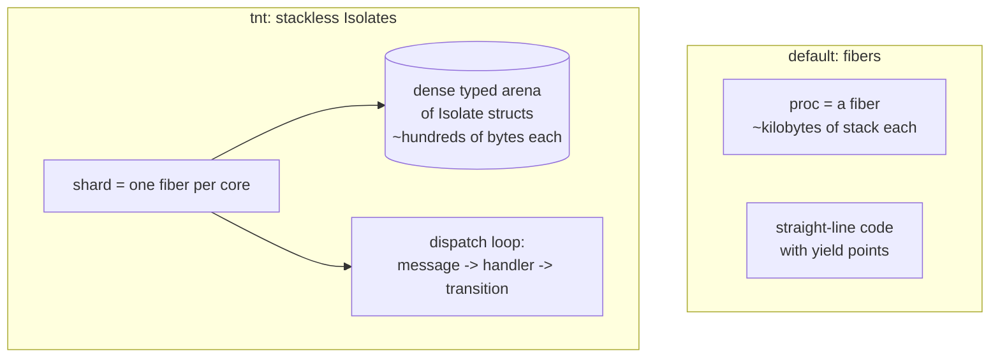

1. TOC
{:toc}

---

Source:
[`examples/08_tnt/echo.c`](https://codeberg.org/gregburd/libxtc/src/branch/main/examples/08_tnt/echo.c)
(~290 lines). The layer itself is a supported part of the library
(`src/orc/tnt.c`,
[`xtc_tnt(3)`](https://codeberg.org/gregburd/libxtc/src/branch/main/man/man3/xtc_tnt.3));
see the dedicated [Isolate layer (tnt / Tina)]({{ '/tnt/' | relative_url }})
section for the full API, philosophy, and rationale.

## The software that inspired it

Two lineages meet here. [Seastar](https://seastar.io/) is the C++
framework behind [ScyllaDB](https://www.scylladb.com/) and
[Redpanda](https://redpanda.com/): thread-per-core, shared-nothing, with
each core owning its data and communicating by explicit message-passing
rather than shared memory. [Tina](https://github.com/pmbanugo/tina)
(written in Odin) took a related idea to its logical end for very large
populations of tiny entities: **stackless Isolates** -- state machines
that react to a message and return a *transition*, holding their state
in a dense typed arena rather than each owning a call stack.

`tnt` reproduces Tina's developer experience on libxtc's machinery. It
is the example that demonstrates the layer libxtc offers as the explicit
alternative to fibers.

## Similar, and different



**Similar to Seastar/Tina:** thread-per-core, shared-nothing; each
entity's state is private; I/O effects are staged and then committed
through the reactor.

**Different from the rest of libxtc:** the [Guide]({{ '/guide/' | relative_url }})
teaches *fibers* -- each unit of work owns a stack and writes
straight-line code. tnt is the opposite trade: a **shard** is one
long-lived fiber per core, and it runs thousands of **stackless
Isolates** out of a dense arena (~hundreds of bytes each) rather than
giving each a ~kilobyte fiber stack. You write state-machine handlers
that return transitions, not linear code.

## How the echo example works

Each connection is its own Isolate; there is no shared socket table and
no lock. An Isolate is a plain struct plus two functions:

- **`echo_init`** records the client fd and submits the first `recv`,
  returning `XTC_TNT_TRANSITION_WAIT_IO`.
- **`echo_handler`** runs on each I/O completion: on a read it echoes the
  bytes back and submits the next `recv`; on error it returns a *crash*
  transition (let it crash), and the scheduler reclaims the Isolate's
  arena slot and generational handle.

The scheduler batches Isolates by type in their arena, references them by
generational handle (so a stale handle to a reclaimed slot is caught),
and commits their staged I/O through libxtc's reactor.

## How libxtc concepts are applied

- **Supervision / let-it-crash.** An Isolate that hits an error returns a
  *crash* transition; the scheduler reclaims its arena slot and
  generational handle. Failure is contained to one Isolate at essentially
  zero cost -- [let it crash]({{ '/philosophy/let-it-crash/' | relative_url }})
  at the finest possible granularity.
- **Data sharing.** Pure shared-nothing per shard: each Isolate's state
  lives in its shard's private arena, and shards communicate only by
  message. This is the message-passing ideal taken to its extreme.
- **Locking.** None -- a shard is single-threaded over its Isolates, so
  there is no intra-shard lock, and cross-shard is by message.
- **The runtime underneath.** Only the shard is a libxtc fiber; it uses
  libxtc's reactor, timers, and I/O directly, so tnt is a scheduler over
  libxtc, not a second runtime.

## Advantages of building it on libxtc

- **Massive populations cheaply.** Hundreds of bytes per Isolate instead
  of a per-fiber stack means you can hold far more concurrent entities in
  the same memory -- the Seastar/Tina win.
- **The same reactor.** Isolates get libxtc's event loop, timers, and
  I/O without a second runtime; only the shard is a fiber.
- **Generational safety.** Reused arena slots get a fresh generation, so
  a dangling Isolate handle is rejected rather than silently aliasing a
  new entity.

## Challenges (warts and all)

- **Stackless code is less linear.** You give up straight-line logic for
  transitions; a multi-step protocol becomes an explicit state machine.
  That is the deliberate cost, and it is why fibers -- not Isolates -- are
  libxtc's default. tnt is here for the workloads where the per-entity
  footprint of a fiber is the binding constraint.
- **Effects must be staged, then committed.** An Isolate cannot block
  mid-handler; it declares its I/O and yields, which takes discipline
  the fiber model does not demand.

## Run it

```sh
cd examples/08_tnt && make XTC_BUILD=../../build
./echo &                        # TCP echo server
```

---

&larr; [kaka (Kafka)]({{ '/examples/kaka/' | relative_url }}) &middot;
Next: [pgmock (PostgreSQL)]({{ '/examples/pgmock/' | relative_url }}) &rarr;
