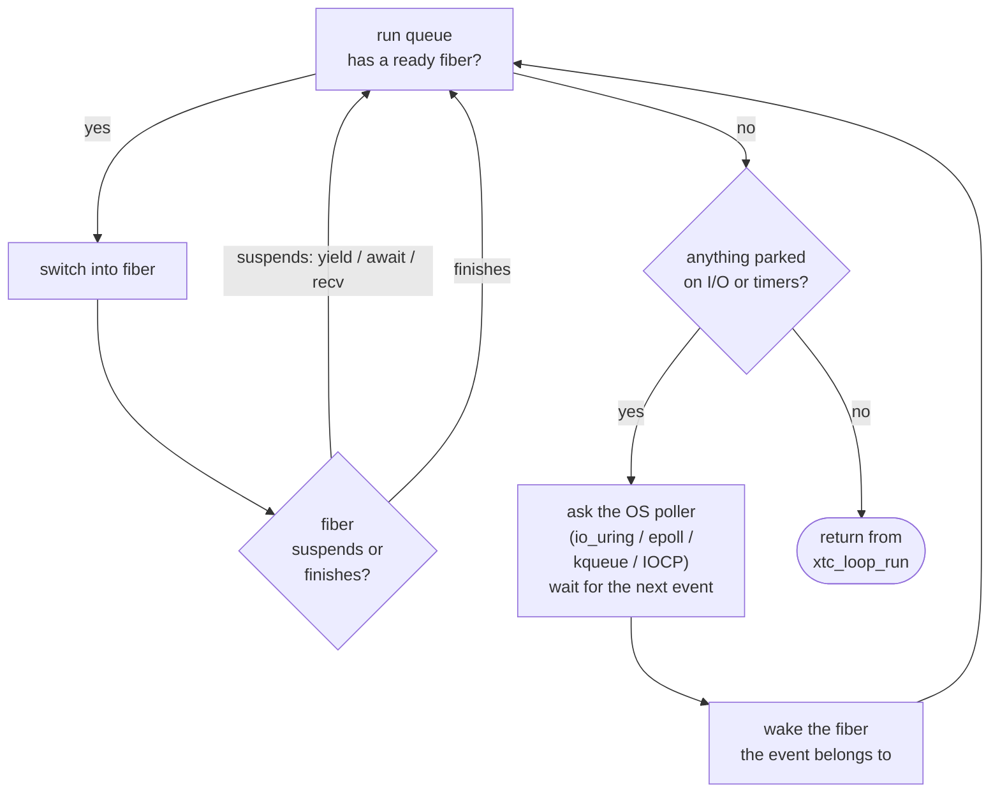

1. TOC
{:toc}

---

In [Getting started]({{ '/guide/01-getting-started/' | relative_url }}) you ran a coroutine that
yielded once and returned a value. This chapter explains what a fiber
*is*, how the loop schedules it, and how to suspend on real work (a
timer, I/O) instead of a bare `xtc_yield`.

## A fiber is a stack you can put down

An ordinary C function owns the CPU from the moment it is called until it
returns; its local variables live on the one call stack. A **fiber**
gives a function its *own* small call stack that libxtc can switch away
from and back to. When a fiber calls `xtc_yield()`, libxtc saves its
registers, restores the loop's registers, and returns to the loop -- the
fiber's stack is untouched, frozen mid-function. Later the loop switches
back, and the function continues on the next line as if nothing
happened.

That switch is a few dozen instructions (a register save/restore written
in per-architecture assembly, or `ucontext` where assembly is not
available) -- no kernel involvement. Compare a thread context switch,
which traps into the scheduler. This is why one loop on one thread can
interleave hundreds of thousands of fibers.

{: .rationale }
> **Why hand-written `fcontext` assembly?** The switch is the hottest
> path in the whole library. The x86-64 System V switch measures about
> 7.6 ns. `ucontext` (the portable fallback) also saves the signal mask
> with a syscall on every switch -- roughly an order of magnitude
> slower. libxtc ships assembly for x86-64, AArch64, ppc64le, riscv64,
> arm, s390x, and sparc64, and falls back to `ucontext` (and Win32
> fibers on Windows) only where it must. See
> [Architecture]({{ '/reference/architecture/' | relative_url }}) for the substrate matrix.

## The loop's job

`xtc_loop_run` is a scheduler. Its cycle is:



1. Pop a ready fiber from the run queue and switch into it.
2. The fiber runs until it *suspends* (yields, awaits I/O, receives a
   message that has not arrived) or *finishes*.
3. If the run queue is empty but fibers are parked on I/O or timers,
   ask the OS poller (io_uring / epoll / kqueue / IOCP) to wait for the
   next event, wake the fiber it belongs to, and loop.
4. When nothing is runnable and nothing is parked, return.

You do not call the scheduler; you *arm* work (spawn fibers, start
timers, issue I/O) and hand it the thread with `xtc_loop_run`.

## Suspending on time, not just yielding

`xtc_yield` gives the CPU back but asks to be rescheduled immediately.
The more useful suspension waits for something. The simplest is a timer:
inside a fiber, `xtc_proc_sleep(ns)` parks *this fiber* for `ns`
nanoseconds while the loop keeps running everything else.

{: .warning }
> Do not call `xtc_sleep_ns` inside a fiber -- it sleeps the whole OS
> thread and stalls every other fiber on the loop. `xtc_sleep_ns` is for
> ordinary thread code; `xtc_proc_sleep` is the fiber-friendly form.
> This distinction -- a blocking call vs. a suspending call -- is the
> single most important habit in libxtc, and
> [Blocking work and I/O]({{ '/guide/05-blocking-and-io/' | relative_url }}) is entirely about it.

## Awaiting a value across fibers

`xtc_await` (from chapter 1) blocks the *caller* until a task finishes.
Called from ordinary thread code after `xtc_loop_run` returns, it simply
reads the already-computed result. Called from *inside* another fiber,
it suspends that fiber until the awaited task completes -- letting you
fan work out and join it back without threads or callbacks.

## Suspending from inside a foreign call chain

Here is the property that a callback runtime cannot match. Because a
libxtc fiber is *stackful* -- it owns a real C call stack -- a suspension
point can live arbitrarily deep in a chain of ordinary C calls,
**including inside a library function that knows nothing about libxtc.**

The classic shape is a library routine that calls back into your code:
`qsort` calling your comparator, `bsearch`, a parser calling a callback
per token. If that callback yields, libxtc freezes the *entire* stack --
the library's frame included -- and restores it intact on resume. The
library never notices.



```
sorted correctly through 20 in-qsort yields: yes
```

{: .rationale }
> **Why this needs a stackful fiber.** When the comparator yields,
> `qsort`'s frame is mid-partition on the fiber's stack. A register swap
> saves the whole stack and returns to the loop; the resume lands right
> back inside the comparator and `qsort` continues. A callback or
> stackless runtime has no stack to put down at that point, so it cannot
> suspend from inside `qsort` at all -- you would have to rewrite the
> sort as a state machine. This is the concrete payoff of the
> [fiber-over-callbacks choice](01-getting-started).

{: .warning }
> The switch is cheap (a register swap), but note the *cost model*: a
> comparator that yields on every compare turns an O(n log n) sort into
> O(n log n) scheduler round-trips, and the fiber holds `qsort`'s stack
> for the whole sort. That is correct and fine -- just be deliberate
> about whether a given callback should yield. A pure CPU comparator
> that never yields runs at full speed with zero runtime overhead.

## What you have learned

- A fiber is a suspendable call stack; switching is a user-space
  register swap.
- The loop schedules ready fibers and parks the rest on the OS poller.
- `xtc_yield` reschedules immediately; `xtc_proc_sleep` suspends on a
  timer; `xtc_await` suspends on another task -- all without blocking
  the thread.

The bare coroutine is the foundation. The next layer up gives each unit
of work an identity and a mailbox, so units can be addressed and can
fail independently: [processes]({{ '/guide/03-processes-and-messages/' | relative_url }}).

---

&larr; [Getting started]({{ '/guide/01-getting-started/' | relative_url }}) &middot;
Next: [Processes and messages]({{ '/guide/03-processes-and-messages/' | relative_url }}) &rarr;
