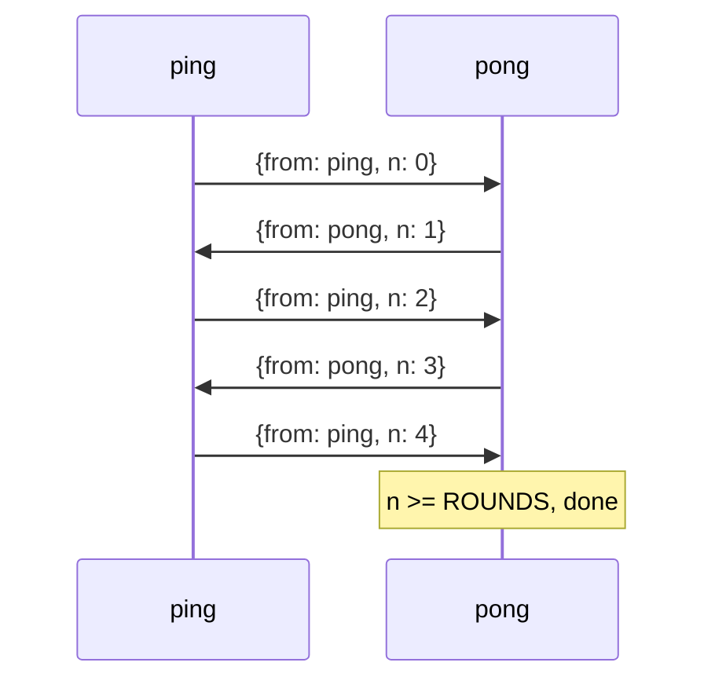

1. TOC
{:toc}

---

A bare coroutine computes and returns. A **process** is a coroutine with
an *identity* (a `xtc_pid_t`) and a *mailbox*: other processes address it
by pid and communicate only by sending it messages. Nothing is shared;
there are no locks on a process's state because no one else can touch it.
This is the Erlang/BEAM model, in C.

## Spawn, send, receive

`xtc_proc_spawn(loop, fn, arg, opts, &pid)` starts `fn(arg)` as a process
and gives you back its pid. Inside a process, `xtc_self()` returns your
own pid, `xtc_send(pid, data, size)` copies `size` bytes into another
process's mailbox, and `xtc_recv(&buf, &size, timeout_ns)` blocks
(suspends the fiber) until a message arrives or the timeout elapses.

Here is a two-process ping/pong. `pong` waits for a number and replies
with one more; `ping` kicks it off and bounces the number back until it
reaches a limit.



Each arrow is one `xtc_send` into the target's mailbox; each process
sits in `xtc_recv` until a message arrives. No shared memory, no locks.



```
ping: got 1
ping: got 3
pong: reached 4, done
```

## Three things to notice

**Messages are copies.** `xtc_send` copies the bytes into the
recipient's mailbox. The sender and receiver never share the buffer, so
there is nothing to lock and no lifetime to coordinate across processes.

**A received buffer is yours to free.** `xtc_recv` hands you a
heap buffer that you own. Release it with
[`xtc_free`](https://codeberg.org/gregburd/libxtc/src/branch/main/man/man3/xtc_free.3)
-- not plain `free`. libxtc may be running under a custom allocator (an
embedder like PostgreSQL installs one), and freeing an
allocator-supplied buffer with the C library `free` is a mismatched-free
bug. Every libxtc call that returns a caller-owned buffer documents
`xtc_free`; that man page lists them.

**There is no sender field.** `xtc_recv` does not tell you who sent the
message. If you need to reply, put your own pid in the payload -- that
is what the `from` field in the example does. This keeps the mailbox a
plain byte queue and lets you design your own protocols on top.

{: .not_chosen }
> **Shared state behind a mutex.** The C default is a struct guarded by a
> `pthread_mutex`. It is faster for a single hot counter, but it does not
> compose: every new invariant adds another lock, lock order becomes a
> global proof obligation, and a thread that dies holding a lock wedges
> everyone. The process model trades a little copy cost for the property
> that state has exactly one owner and failure is contained to that
> owner. libxtc still ships mutexes, rwlocks, RCU, and a lock manager
> ([Locks and synchronization]({{ '/reference/locks/' | relative_url }})) for the cases that genuinely
> want shared memory -- but the *default* unit of concurrency is the
> shared-nothing process.

## Selective receive

Sometimes a process wants the *next message that matches a predicate*,
leaving others in the mailbox for later. `xtc_recv_match(match_fn,
user_data, &buf, &size, timeout)` scans the mailbox and returns the
first message for which `match_fn` returns non-zero, preserving the
arrival order of the rest. This is how you implement a request/response
correlation (pull the reply with *your* request id) without draining
unrelated traffic. See
[`xtc_proc(3)`](https://codeberg.org/gregburd/libxtc/src/branch/main/man/man3/xtc_proc.3).

## Resource scope: release on every exit path

A process holds resources -- a file descriptor, a buffer, a lock. The
awkward question is *what releases them when the process does not exit
the way you drew on the whiteboard*: an early error return, an
`xtc_exit_self`, an asynchronous kill from a supervisor, or a contained
fault. In plain C the answer is a maze of `goto out` labels, and every
new exit path is a chance to leak.

`xtc_scope` turns "this will be released" from a convention you have to
remember into a mechanism the runtime enforces. Open a scope, *defer* a
finalizer into it, and the finalizer runs in LIFO order on **every** exit
path while the scope is open -- normal close, error, exit, abort, or a
fault-guard-contained crash. (A scope is a marker on the same per-process
recovery registry that already releases fds and locks on an unwind, so it
rides the same cleanup.)



Most of the time you want the acquire/use/release shape, and
`xtc_bracket` is the sugar for it. The acquire runs *cancellation-masked*
so the release is registered before an abort can ever be observed, and
the release then runs on every exit path of the use step:



{: .not_chosen }
> **The "paper door" this closes.** For years, effect systems shipped
> resource lifecycles as a *convention*: the API carrots you toward
> acquire/use/release, but nothing stops you walking past it and leaking
> a socket on the cancellation path. A human respects the paper door; a
> coding agent barges straight through it. `xtc_bracket` is a real door:
> the release is wired to the unwind, so there is no exit path that
> skips it.

## Cancellation masking

Cancellation in libxtc is *cooperative*: a running fiber observes an
asynchronous kill (from `xtc_exit_pid`, a supervisor, or a deadline)
only at a park point -- a `xtc_yield`, `xtc_recv`, or `xtc_proc_sleep`.
That is usually what you want, but it leaves one race: if a kill lands
*between* acquiring a resource and registering its release, the release
is never registered. `xtc_uncancelable` closes it. It runs a body with
cancellation **masked**: a kill delivered inside the region is deferred
and only observed once the region returns. `xtc_bracket` uses it for you
around the acquire; you can use it directly for any acquire-then-register
critical step. `xtc_cancel_poll` is the escape hatch that re-admits
cancellation for a sub-region, and `xtc_cancel_requested` lets a masked
region notice a pending kill and unwind early and cleanly. See
[`xtc_scope(3)`](https://codeberg.org/gregburd/libxtc/src/branch/main/man/man3/xtc_scope.3).

## What you have learned

- A process is an addressable, mailbox-owning coroutine with private
  state.
- `xtc_send` copies; `xtc_recv` / `xtc_recv_match` receive; received
  buffers are freed with `xtc_free`.
- Replies carry the sender pid in the payload by convention.
- `xtc_scope` / `xtc_bracket` release resources on every exit path;
  `xtc_uncancelable` masks cancellation so a release is never lost to a
  mid-acquire abort.

Processes let things run independently. The next chapter is about what
happens when one of them *fails*, and how to build systems that recover:
[links, monitors, and supervisors]({{ '/guide/04-supervision/' | relative_url }}).

---

&larr; [Fibers and the event loop]({{ '/guide/02-fibers-and-the-loop/' | relative_url }}) &middot;
Next: [Links, monitors, and supervisors]({{ '/guide/04-supervision/' | relative_url }}) &rarr;
