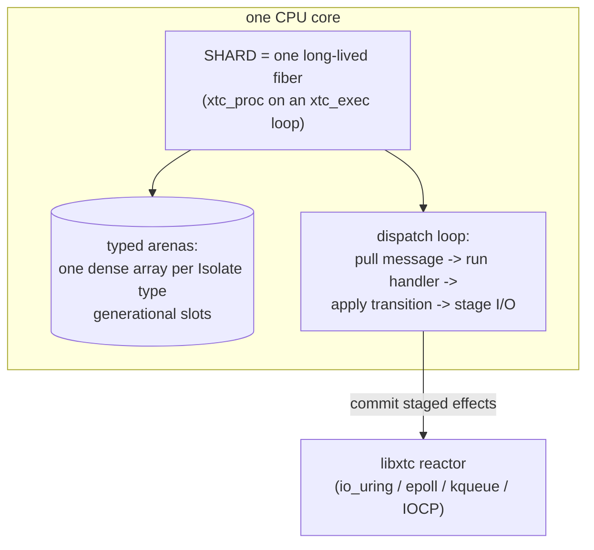

1. TOC
{:toc}

---

{: .note }
> **tnt is optional.** It is not a layer libxtc requires, and nothing in
> the core runtime depends on it. The [Guide]({{ '/guide/' | relative_url }})
> teaches the whole library -- fibers, processes, supervision, I/O --
> with no mention of tnt, and the vast majority of programs never touch
> it. tnt is a *specialized alternative* you reach for only when a
> specific constraint (below) makes it worth the extra discipline. If you
> are not sure whether you need it, you do not.

Almost everything in libxtc is built on **fibers**: each unit of work
owns a small call stack and writes straight-line code with yield points.
The **Isolate layer** -- `tnt` -- is an optional, supported add-on
([`xtc_tnt(3)`](https://codeberg.org/gregburd/libxtc/src/branch/main/man/man3/xtc_tnt.3),
`src/orc/tnt.c`) that offers the opposite trade for one narrow case: a
very large population of tiny, uniform entities, where even a
kilobyte-scale fiber stack *each* is too much memory.

## Where it comes from: Tina, for C, on libxtc

tnt is heavily design-influenced by
[**Tina**](https://github.com/pmbanugo/tina), a stackless
actor/state-machine runtime written in Odin. Tina's core idea is that an
actor need not own a call stack at all: it can be a plain struct plus a
handler that reacts to a message and returns a **transition** (wait for
I/O, wait for a message, done, or crash), with its state held in a dense
typed arena. That makes each entity cost hundreds of bytes instead of a
stack, so a single machine can hold enormous populations of them.

tnt takes that design and:

- **targets the C programmer** -- the API is ordinary C structs and
  functions ([`xtc_tnt(3)`](https://codeberg.org/gregburd/libxtc/src/branch/main/man/man3/xtc_tnt.3)),
  not Odin; and
- **layers it on libxtc** -- which is a natural match, because libxtc
  already provides the thread-per-core executor, the reactor, timers,
  and the deterministic-simulation machinery a stackless scheduler
  needs. tnt is a scheduler and an arena allocator over the libxtc
  runtime, not a second runtime.

The result reproduces Tina's developer experience for a C audience
without asking them to adopt a new language or a parallel event system.
(The other well-known thread-per-core, shared-nothing system,
[Seastar](https://seastar.io/) behind [ScyllaDB](https://www.scylladb.com/)
and [Redpanda](https://redpanda.com/), is the same architectural family;
tnt sits in that lineage but its immediate design model is Tina.)

## The core idea: shard is a fiber, Isolate is not

A **shard** is one long-lived libxtc fiber per `xtc_exec` loop -- so one
per core. It owns typed arenas (one dense array per Isolate type,
slab-carved at boot) and runs a dispatch loop: pull the next message, run
the target Isolate's handler, apply the transition it returns, and commit
any staged I/O through the reactor. Thousands of Isolates share the one
shard fiber; each is ~hundreds of bytes of arena struct rather than a
~kilobyte fiber stack. Isolates are referenced by **generational
handle**, so a stale handle to a reclaimed slot is rejected rather than
aliasing a new entity.

## When to choose tnt vs. plain libxtc

Reach for tnt **only** when the answer to *all three* is yes; otherwise
use plain libxtc fibers and processes.

| Decision marker | Plain libxtc (fibers/procs) | tnt (Isolates) |
|---|---|---|
| **How many concurrent entities?** | Thousands to a few hundred thousand | Millions, or bounded only by data size |
| **Is per-entity memory the binding constraint?** | No -- a KB-scale stack each is fine | **Yes** -- a fiber stack each would not fit |
| **What does each entity do per event?** | Non-trivial, multi-step linear logic | A little work per message; a small state machine |
| **Is the logic naturally straight-line?** | Yes -- keep it linear, use fibers | It is already a state machine, so stackless costs little |

The single clearest marker: **if you can afford a fiber per entity, use a
fiber per entity.** A fiber's straight-line code is simpler to write,
read, and debug. tnt earns its keep exactly when the *count* is so large
that per-fiber stack memory -- not CPU, not code clarity -- is what stops
you.

{: .rationale }
> **Why the shard-is-a-fiber split.** tnt does not make every Isolate a
> fiber (that would defeat the memory win) and it does not abandon
> libxtc (that would mean a second runtime). It makes exactly *one* fiber
> per core -- the shard -- and runs the cheap stackless Isolates inside
> it. You get libxtc's reactor, timers, executor, and deterministic
> testing, and pay a fiber stack only per core, not per entity.

{: .not_chosen }
> **Why fibers stay the default.** Stackless code is less linear: a
> multi-step protocol becomes an explicit state machine, and an Isolate
> may not block mid-handler -- it declares its I/O and yields. Mailboxes
> are drop-on-full, so a design must treat message loss as normal
> backpressure. Those are real costs in readability and discipline,
> which is why libxtc's default unit of concurrency is the fiber-backed
> process, and tnt is opt-in.

## Benefits and drawbacks

**Benefits**

- **Enormous populations in modest memory** -- hundreds of bytes per
  Isolate instead of a per-fiber stack.
- **One runtime, not two** -- Isolates use libxtc's event loop, timers,
  and I/O; only the shard is a fiber.
- **Generational-handle safety** against use-after-reclaim.
- **Shared-nothing per shard** -- no cross-core locking on Isolate state.
- **Deterministically testable** on the same simulator as the rest of
  libxtc (see [Testing]({{ '/testing/' | relative_url }})).

**Drawbacks**

- **You write transitions, not straight-line code** -- a state machine
  per entity.
- **No blocking mid-handler** -- effects are staged and committed, not
  awaited inline.
- **Drop-on-full mailboxes** -- message loss is a backpressure signal
  your design must handle, not an error.
- **A narrower model** -- it fits the many-tiny-entities case and is a
  poor fit for the general one, which is precisely why it is optional.

## The API

All functions are in
[`xtc_tnt(3)`](https://codeberg.org/gregburd/libxtc/src/branch/main/man/man3/xtc_tnt.3):

- **Lifecycle** --
  [`xtc_tnt_start`](https://codeberg.org/gregburd/libxtc/src/branch/main/man/man3/xtc_tnt.3) /
  [`xtc_tnt_stop`](https://codeberg.org/gregburd/libxtc/src/branch/main/man/man3/xtc_tnt.3):
  bring the sharded scheduler up and down from a spec (shard count,
  Isolate type table, arena sizes).
- **Spawning** --
  [`xtc_tnt_spawn`](https://codeberg.org/gregburd/libxtc/src/branch/main/man/man3/xtc_tnt.3) /
  [`xtc_tnt_spawn_on`](https://codeberg.org/gregburd/libxtc/src/branch/main/man/man3/xtc_tnt.3):
  create an Isolate of a type (anywhere, or on a chosen shard), returning
  a generational handle.
- **Messaging** --
  [`xtc_tnt_send`](https://codeberg.org/gregburd/libxtc/src/branch/main/man/man3/xtc_tnt.3):
  deliver a tagged message to an Isolate handle (drop-on-full).
- **I/O** --
  [`xtc_tnt_submit_recv`](https://codeberg.org/gregburd/libxtc/src/branch/main/man/man3/xtc_tnt.3),
  [`xtc_tnt_io_send`](https://codeberg.org/gregburd/libxtc/src/branch/main/man/man3/xtc_tnt.3),
  [`xtc_tnt_submit_close`](https://codeberg.org/gregburd/libxtc/src/branch/main/man/man3/xtc_tnt.3):
  stage socket I/O whose completion arrives as a message.
- **Timers** --
  [`xtc_tnt_register_timer`](https://codeberg.org/gregburd/libxtc/src/branch/main/man/man3/xtc_tnt.3):
  a timer that fires as a tagged message.
- **In-handler context** --
  [`xtc_tnt_self`](https://codeberg.org/gregburd/libxtc/src/branch/main/man/man3/xtc_tnt.3),
  [`xtc_tnt_shard_id`](https://codeberg.org/gregburd/libxtc/src/branch/main/man/man3/xtc_tnt.3),
  [`xtc_tnt_scratch_arena`](https://codeberg.org/gregburd/libxtc/src/branch/main/man/man3/xtc_tnt.3).

A handler returns a `xtc_tnt_transition_t`: `WAIT_IO`, `WAIT_MESSAGE`,
`DONE`, or a crash transition (let it crash; the slot and handle are
reclaimed).

## The example

[`examples/08_tnt/echo.c`](https://codeberg.org/gregburd/libxtc/src/branch/main/examples/08_tnt/echo.c)
is a TCP echo server where each connection is its own Isolate -- no
shared socket table, no lock. The
[tnt example page]({{ '/examples/tnt/' | relative_url }}) walks through
`echo_init` and `echo_handler` and how a connection becomes a state
machine.

---

See also: the [tnt example]({{ '/examples/tnt/' | relative_url }}),
[`xtc_tnt(3)`](https://codeberg.org/gregburd/libxtc/src/branch/main/man/man3/xtc_tnt.3),
and the [Choices]({{ '/philosophy/choices/' | relative_url }}) essay.
