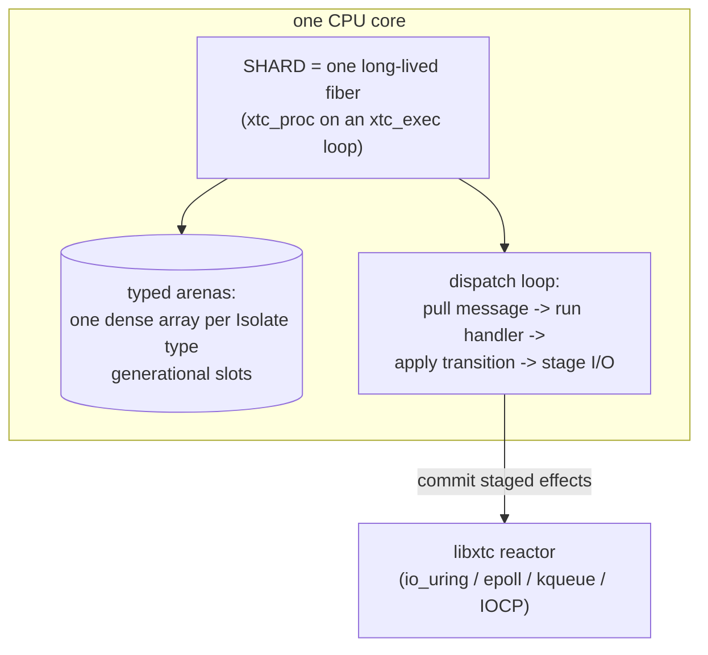

1. TOC
{:toc}

---

Everything else in libxtc is built on **fibers**: each unit of work owns
a small call stack and writes straight-line code with yield points. The
**Isolate layer** -- `tnt` -- is the deliberate opposite trade, offered
as a first-class, supported part of the library
([`xtc_tnt(3)`](https://codeberg.org/gregburd/libxtc/src/branch/main/man/man3/xtc_tnt.3),
`src/orc/tnt.c`). It exists for the workloads where a per-fiber stack is
the binding constraint: a very large population of tiny, uniform
entities.

## Lineage: Seastar and Tina

Two systems inspired this layer.

- [**Seastar**](https://seastar.io/) is the C++ framework behind
  [ScyllaDB](https://www.scylladb.com/) and
  [Redpanda](https://redpanda.com/): thread-per-core, shared-nothing.
  Each core (shard) owns its slice of the data and communicates with
  other cores by explicit message-passing, never by shared memory and
  locks. This eliminates cross-core cache-line contention -- the thing
  that most limits many-core scaling.
- [**Tina**](https://github.com/pmbanugo/tina) (written in Odin) pushed
  a related idea to its limit for huge populations of small entities:
  **stackless Isolates**. An Isolate is a plain struct plus a handler
  function; it reacts to a message and returns a **transition** (wait for
  I/O, wait for a message, done, or crash). Its state lives in a dense
  typed arena, not on a call stack.

`tnt` reproduces Tina's developer experience on libxtc's machinery.

## The core idea: shard is a fiber, Isolate is not

A **shard** is one long-lived fiber per `xtc_exec` loop -- so one per
core. It owns typed arenas (one dense array per Isolate type, slab-carved
at boot) and runs a dispatch loop: pull the next message, run the target
Isolate's handler, apply the transition it returns, and commit any staged
I/O through the reactor. Thousands of Isolates share the one shard fiber;
each is ~hundreds of bytes of arena struct rather than a ~kilobyte fiber
stack.

Isolates are referenced by **generational handle**: a reused arena slot
gets a new generation, so a stale handle to a reclaimed Isolate is
rejected rather than silently aliasing a new one.

## Why it exists (and why it is not the default)

{: .rationale }
> **When to reach for Isolates.** Use them when the *number* of
> concurrent entities is so large that a per-fiber stack (kilobytes each)
> would dominate memory -- millions of connections, cells, or actors that
> each do a little work per message. The dense arena makes that
> affordable.

{: .not_chosen }
> **Why fibers remain the default.** Stackless code is less linear: a
> multi-step protocol becomes an explicit state machine, and an Isolate
> may not block mid-handler -- it declares its I/O and yields. That is a
> real cost in readability and discipline. For the common case (a
> moderate number of connections or tasks, each with non-trivial linear
> logic), fibers are simpler and just as fast. libxtc offers both and
> makes the trade explicit rather than picking for you -- the same
> philosophy as the rest of the [Choices]({{ '/philosophy/choices/' | relative_url }})
> page.

## The API in one breath

- `xtc_tnt_start` / `xtc_tnt_stop` -- bring the sharded scheduler up and
  down from a spec (shard count, Isolate type table, arena sizes).
- `xtc_tnt_spawn` / `xtc_tnt_spawn_on` -- create an Isolate of a given
  type (anywhere, or on a chosen shard), returning a generational handle.
- `xtc_tnt_send` -- deliver a tagged message to an Isolate handle
  (drop-on-full mailboxes: backpressure by design).
- `xtc_tnt_submit_recv` / `xtc_tnt_io_send` / `xtc_tnt_submit_close` --
  stage socket I/O whose completion arrives as a message.
- `xtc_tnt_register_timer` -- a timer that fires as a tagged message.
- `xtc_tnt_self` / `xtc_tnt_shard_id` / `xtc_tnt_scratch_arena` --
  in-handler context.

A handler returns a `xtc_tnt_transition_t`: `WAIT_IO`, `WAIT_MESSAGE`,
`DONE`, or a crash transition (let it crash; the slot and handle are
reclaimed). The full contract is in
[`xtc_tnt(3)`](https://codeberg.org/gregburd/libxtc/src/branch/main/man/man3/xtc_tnt.3).

## The example

[`examples/08_tnt/echo.c`](https://codeberg.org/gregburd/libxtc/src/branch/main/examples/08_tnt/echo.c)
is a TCP echo server where each connection is its own Isolate -- no
shared socket table, no lock. It mirrors Tina's own README echo. The
[tnt example page]({{ '/examples/tnt/' | relative_url }}) walks through
`echo_init` and `echo_handler` and how a connection becomes a state
machine.

## Advantages and challenges

**Advantages:** enormous entity populations in modest memory; the same
libxtc reactor, timers, and I/O with no second runtime (only the shard is
a fiber); generational-handle safety against use-after-reclaim;
shared-nothing per-shard state, so no cross-core locking.

**Challenges:** you write transitions, not straight-line code; effects
must be staged and then committed rather than awaited inline; and message
mailboxes are drop-on-full, so a design must treat message loss as a
normal backpressure signal, not an error.

---

See also: the [tnt example]({{ '/examples/tnt/' | relative_url }}),
[`xtc_tnt(3)`](https://codeberg.org/gregburd/libxtc/src/branch/main/man/man3/xtc_tnt.3),
and the [Choices]({{ '/philosophy/choices/' | relative_url }}) essay.
